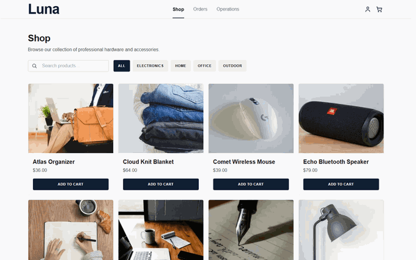
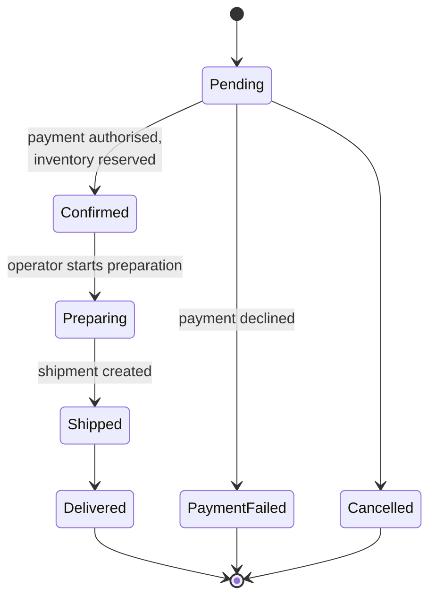
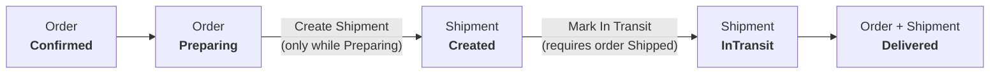
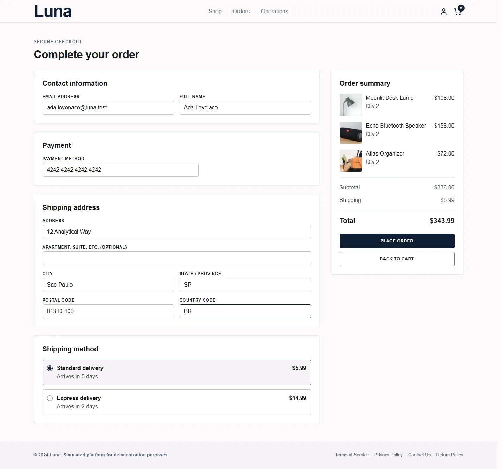
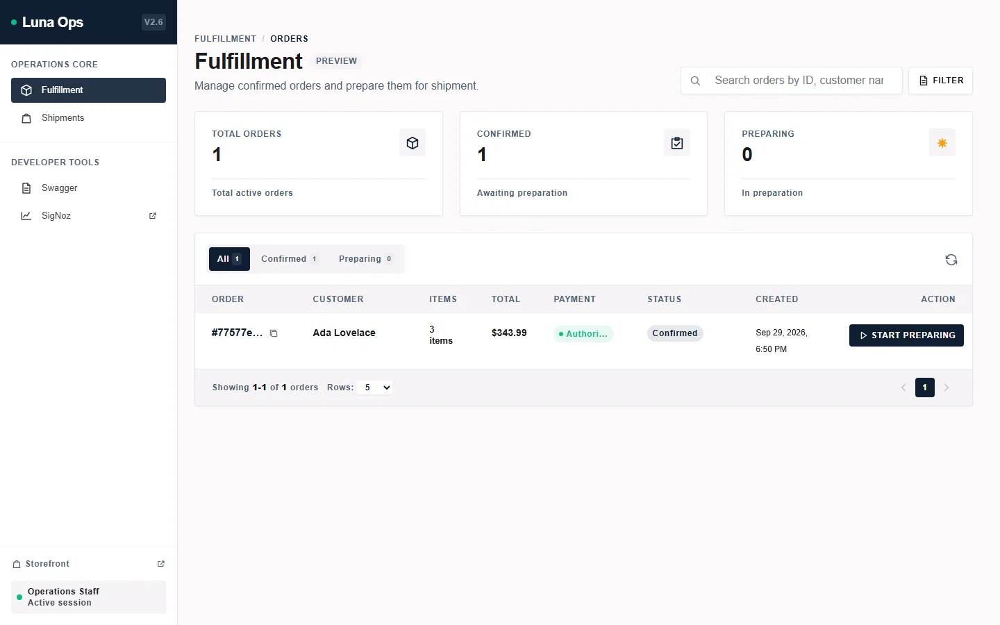
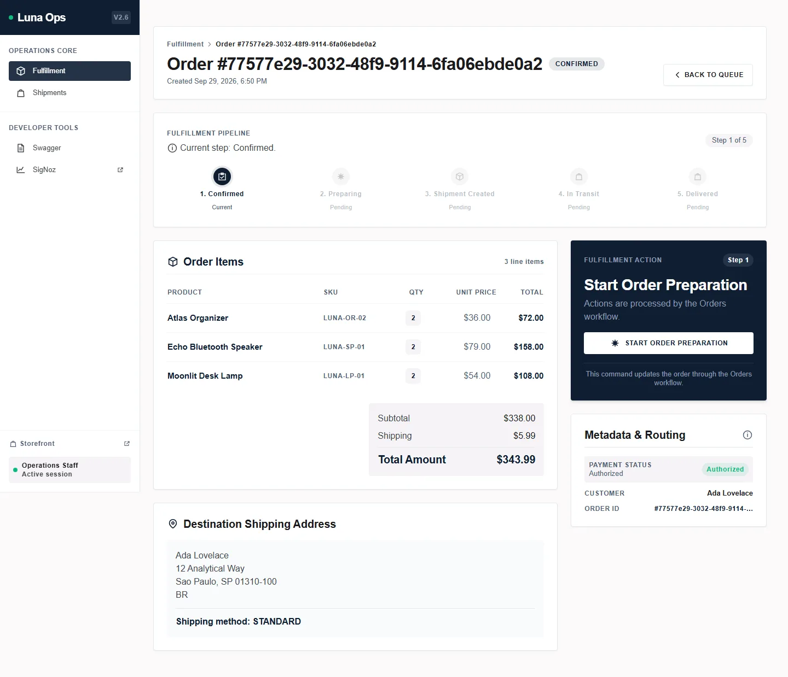
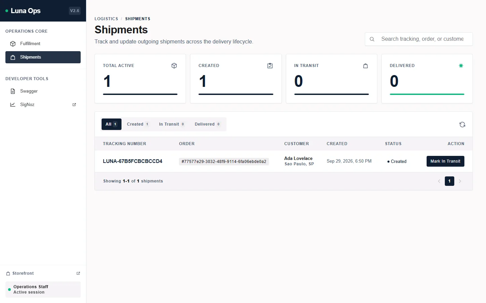
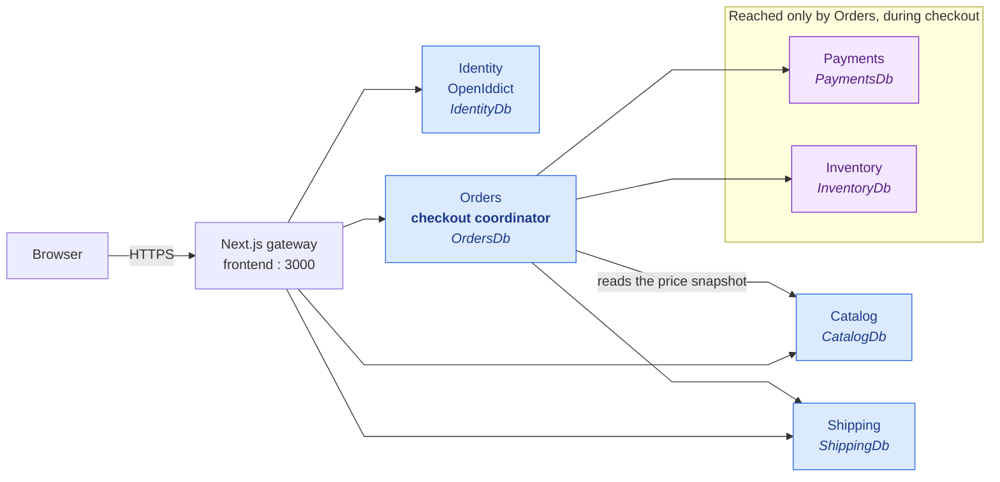

# Luna

**Distributed commerce and logistics, built to see what breaks.**

Luna is an order-management system that treats the boring parts of an online
store as distributed-systems problems. A customer checks out; the order has to
be paid for, reserved against stock, picked, packed, shipped and tracked — and
every one of those steps can fail, take time, or arrive twice. Luna exists to
make those behaviours visible and recoverable rather than assumed away.

It is a learning platform. Each phase introduces a real problem so the
architecture has a reason to change.



---

## What actually happens to an order

Checkout does not "create an order". It starts a pipeline with a real state
machine, and every transition is guarded in the domain rather than assumed by
the caller.



The states are `OrderStatus` in `src/Services/Orders/Orders.Domain/Order.cs`,
and each move is a method on the aggregate that refuses to run from the wrong
state. `PaymentFailed` and `Cancelled` are terminal branches, not retries.

Fulfilment then interleaves the order with a shipment, and the two are not
allowed to drift apart:



That coupling is the point. A shipment cannot be created before the order is
being prepared, and a shipment cannot move while the order has not shipped. The
guards live in `Order.cs` as `EnsureShipmentCreationAllowed`,
`EnsureStatusForShipmentInTransit` and `EnsureDeliveryAllowed`.

---

## The application

**Customer side**

| Storefront | Checkout |
| --- | --- |
|  |  |
| Catalogue with search and category filters. Every product is a real database record. | The transaction: contact, payment method, shipping address and a chosen shipping method, all validated before the order exists. |

**Operations side**

| Fulfillment queue | Fulfillment detail | Shipments |
| --- | --- | --- |
|  |  |  |
| The operator's queue: confirmed orders awaiting preparation, with payment status and a one-click action. | The five-step pipeline, the order lines with their SKUs, the totals, and the next command available. | Every shipment with a real tracking number, its status, and the action to move it forward. |

The fulfillment detail screen is the clearest single picture of the whole
system: the pipeline at the top, the goods and money in the middle, and the
single operation you are allowed to perform right now on the right.

---

## Architecture



Three decisions shape everything else:

**The browser talks to one service.** The Next.js gateway is the only public
HTTP boundary. Backend containers are not published, and nothing in the frontend
addresses a Docker service name.

**Orders orchestrates checkout.** It is the one place where several services
must agree, so `Orders` coordinates it: it calls Inventory, Payments and Shipping
with short-lived service tokens, and reads the product price snapshot from
Catalog, which is public browsing data and needs no credential. The frontend has
API clients for four services and never touches Payments or Inventory.

**A service owns its data.** Six databases, and no service reads another's
tables. Cross-service work goes through an application port and a service token,
never a shared connection string. Fulfilment is a module inside Orders rather
than a service of its own, though the operations console presents it as its own
area.

Messaging arrives in Phase 2 on AWS primitives — an EventBridge bus, SQS with
dead-letter queues, and SES — declared in Terraform so the same files target a
local emulator, a server, and real AWS. The emulator is a development tool and is
never deployed.

The full architecture, including the token flows and where the data lives, is in
**[documentation/architecture.md](documentation/architecture.md)**.

---

## What is built today

- **6 backend services** on .NET 8, across 29 projects, plus a Next.js frontend.
- **6 SQL Server databases**, one per service, migrated on startup.
- **A five-step fulfillment pipeline** with domain-guarded transitions and a
  live operations console.
- **OpenIddict authentication** with role-based access; the operations console is
  gated on `Admin` by a real authorization policy, not just a hidden link.
- **93 test files** — 57 backend, 36 frontend.
- **3 CI workflows** covering validation, Docker image publishing, and Terraform
  plan/apply.

Phase 1 is in closure. Phase 2 — messaging and asynchronous workflows — is the
next one.

---

## Run it

```bash
cp infrastructure/.env.example infrastructure/.env    # then edit it
docker compose -f infrastructure/docker-compose.yml up --build
```

That is the whole stack: SQL Server, the six services, the gateway and the AWS
emulator. Storefront at <http://localhost:3000>, API explorer at
<http://localhost:3000/swagger>.

Full instructions, including frontend hot reload, observability, Terraform and
the demo scripts, are in **[Getting Started](documentation/getting-started.md)**.

---

## Roadmap

| Phase | Focus |
| --- | --- |
| 0 | Architecture & Foundation |
| 1 | Basic Commerce Flow |
| 2 | Messaging & Async Workflows |
| 3 | Realistic Time & Simulation |
| 4 | Reliability & Failure Handling |
| 5 | Transactional Outbox |
| 6 | Payment Abstraction |
| 7 | Fulfillment Service |
| 8 | Observability |
| 9 | Operations Dashboard |
| 10 | Redundancy & Resilience |
| 11 | Chaos & Failure Simulation |
| 12 | Security |
| 13 | Testing & Quality |
| 14 | Production-like Local Infrastructure |
| 15 | AWS |
| 16 | Production Scenarios & Edge Cases |

Phase **status** lives in one place only — the
[roadmap's status table](documentation/roadmap.md), which is kept current as work
lands.
The reasoning behind each phase, and what has actually shipped, is in the
[roadmap](documentation/roadmap.md).

---

## Documentation

The repository separates **what Luna is**, **how it is put together**, **where
it is going**, and **how each phase was designed**.

- **[Getting Started](documentation/getting-started.md)** — run it locally
- **[Architecture](documentation/architecture.md)** — how it fits together today:
  services, data ownership, the gateway boundary, token flows, the order
  lifecycle, and the known gaps
- [Roadmap](documentation/roadmap.md) — project vision and phase status
- [Phase 0 Design](documentation/dev_phases/phase-0/design.md) — foundation and architectural decisions
- [Phase 1 Specification](documentation/dev_phases/phase-1/spec.md) — commerce flow requirements
- [Phase 1 Architecture](documentation/dev_phases/phase-1/architecture.md) — boundaries and decisions
- [Phase 1 Operations Architecture](documentation/dev_phases/phase-1/ops-architecture.md) — the fulfillment and shipment workflow
- [Phase 2 Specification](documentation/dev_phases/phase-2/spec.md) — messaging behaviour and acceptance criteria
- [Phase 2 Architecture](documentation/dev_phases/phase-2/architecture.md) — emulator choice, AWS mapping, resource ownership
- [Observability](documentation/observability.md) — OpenTelemetry, SigNoz, tracing a checkout

The phase documents are historical records: each says so at the top and points
at the architecture document for the current picture.

Frontend implementation detail lives in [`src/Frontend/`](src/Frontend/).

---

## License

MIT — see [LICENSE](LICENSE).
