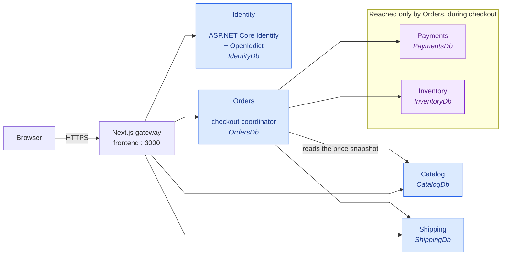
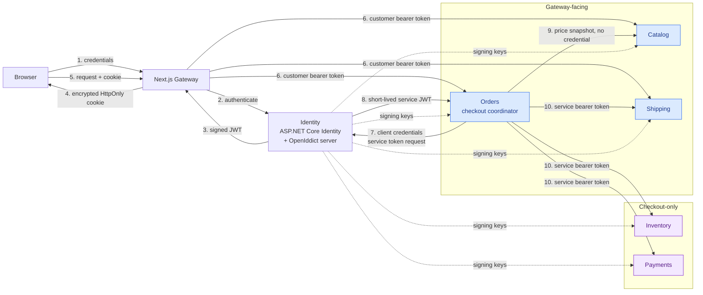
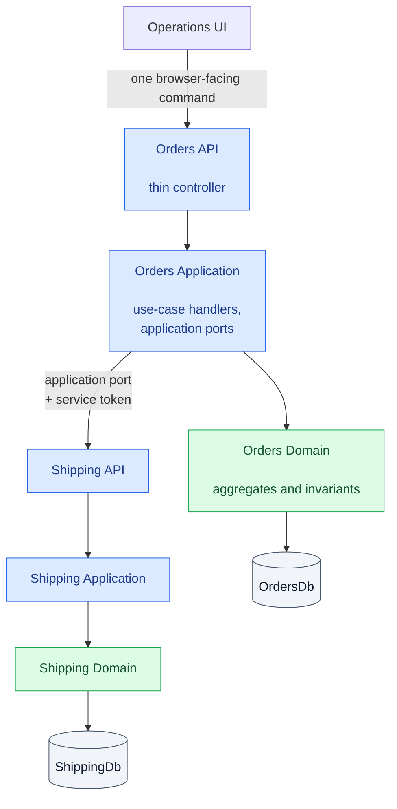
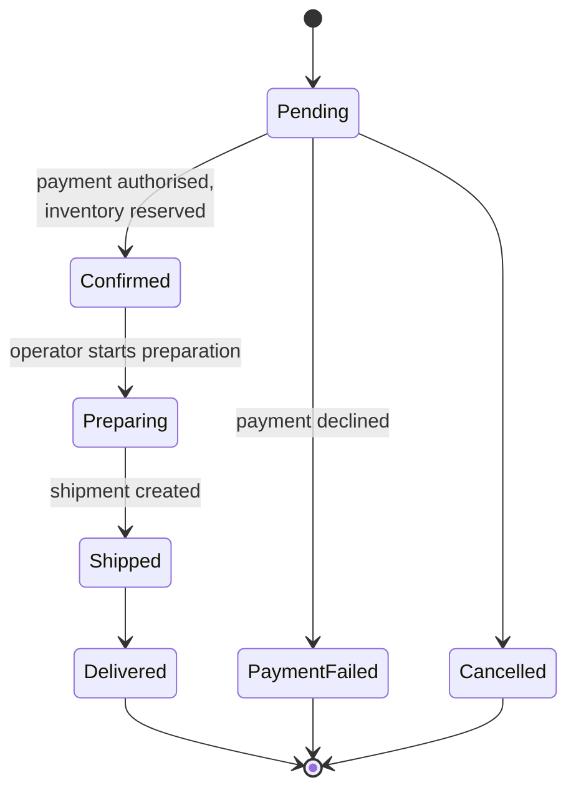
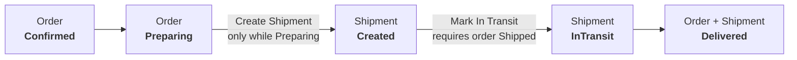
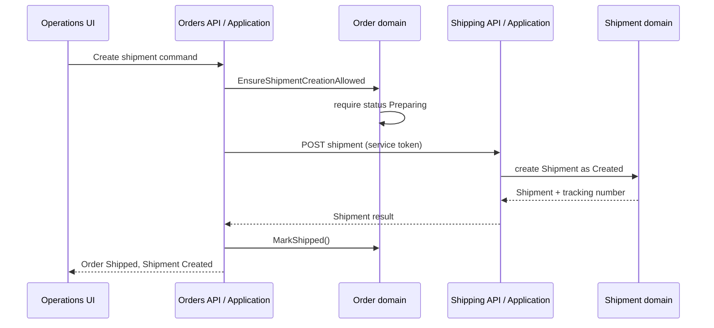

# Luna Architecture

The architecture of Luna **as it stands today**. It is a current-state document:
everything here is verifiable against the code, and the last verification is
recorded in [§11](#11-what-this-document-is-checked-against).

It deliberately sits **alongside** the phase documents rather than replacing
them. Those record why the system was designed the way it was, in the order it
was designed. This one records what the result is. Where the two disagree, this
document is the description of the current system and the phase document is the
history — but a disagreement between either and the code is a bug in both, and
is worth reporting rather than papering over.

| If you want to know | Read |
| --- | --- |
| What Luna is and whether it works | [the README](../README.md) |
| How the system is put together | this document |
| How to run it | [Getting Started](getting-started.md) |
| Why it is going this way | [Roadmap](roadmap.md) |
| Why each phase was designed as it was | `dev_phases/phase-N/` |
| How to read the traces | [Observability](observability.md) |

---

## 1. The shape of the thing

Six backend services, each owning its own database, behind a single HTTP entry
point. The browser talks to four of them. The two it does not talk to, it does
not need to know about.

Two things in that diagram are worth stating in words, because they are the
design rather than the plumbing.

**Orders is the orchestrator.** Checkout is the one place where several
services must agree, so `Orders` coordinates it. It holds five outbound clients,
registered in
[`OrdersInfrastructureExtensions.cs`](../src/Services/Orders/Orders.Infrastructure/OrdersInfrastructureExtensions.cs):

| Client | Target | Credential |
| --- | --- | --- |
| `ICatalogCheckoutClient` | Catalog | none — the product read is public browsing data |
| `IInventoryCheckoutClient` | Inventory | service token, scope `InventoryReservationsWrite` |
| `IPaymentsCheckoutClient` | Payments | service token, scope `PaymentsAuthorize` |
| `IShippingCheckoutClient` | Shipping | service token, scope `ShippingShipmentsWrite` |
| `IShippingFulfillmentClient` | Shipping | service token, scope `ShippingShipmentsWrite` |

**Fulfilment is not a service.** It is a module inside Orders — the queue, the
prepare step, and the shipment command — surfaced through
`FulfillmentController` in `Orders.Api`. It is called out here because the
operations console presents it as its own area, and because the roadmap lists
extracting it as a possible later phase.

---

## 2. The gateway boundary

The Next.js application is the only thing the browser can reach. Backend
containers are not published to the host in the default Compose file, and the
browser never addresses a Docker service name.

The gateway proxies, it does not aggregate. It rewrites `/api/services/<name>`
to the service's own route prefix and forwards the request; it introduces no BFF
DTOs. That is a deliberate choice, revisitable if the operations console ever
needs a view that spans services in one round trip.

The rewrite table covers all six services, but the frontend only has API
clients for four — `lib/api/` contains `auth`, `catalog`, `identity`, `orders`
and `shipping`. Nothing in the frontend calls Payments or Inventory. That is the
point: the browser has no idea reservations or authorizations exist.

---

## 3. Identity, tokens, and the two kinds of service call

Luna has two distinct credentials, and conflating them is the easiest mistake
to make when reading this codebase.

**Step 6, the customer token.** The gateway validates the session cookie and
calls the service with the customer's own bearer token. Shipping authorizes
against it directly. Catalog does not: the catalog surface is public browsing
data.

**Step 9, the product read.** When `Orders` calls Catalog during checkout it
sends no credential. `CatalogController` carries no `[Authorize]` attribute and
Catalog registers no fallback authorization policy, so the product read is
anonymous by construction. `Orders` is reading the same price and SKU data the
storefront already serves, not a customer-scoped resource, so a customer token
would assert something the call does not depend on. The `Product` entity has no
stock or cost field, so the response carries nothing to protect. The
[Phase 1 architecture](dev_phases/phase-1/architecture.md) diagram shows Catalog
among the service-token calls; the code has never done that.

**Step 10, service tokens.** Inventory, Payments and Shipping are called with a
token minted by `ServiceTokenHandler`, which requests a short-lived JWT from
Identity with a declared scope and *replaces* any existing `Authorization`
header. Each call site declares the scope it needs, so a service token for
`PaymentsAuthorize` cannot be replayed against Shipping.

`POST api/v1/quotes` and the shipment write endpoints enforce this with
`LunaServicePolicies.OrdersShippingShipmentsWrite`, which requires both the
`orders` client id and the scope. Publishing shipping *methods* stays anonymous
because the storefront lists them; creating a quote does not, because it writes
to the Shipping database. Note that a quote carries no ownership check: Orders
mints the `orderId` itself and persists the order only after the quote returns,
so Shipping has no order to validate against and `ShippingQuotes.OrderId` is an
indexed column rather than a foreign key.

No session store, no Redis, no sticky sessions. The encrypted HttpOnly cookie
is the session.

---

## 4. Inside a service

Every service that follows the five-project template has the same shape, and the
boundaries are load-bearing: a controller may not hold business rules, and an
application handler may not reach another service's data.

Identity is the documented exception: a single `Identity.csproj` whose host
predates the template, with folders that still keep the responsibilities apart.

---

## 5. Data ownership

One database per service. No service reads another's tables, ever; cross-service
work goes through an application port.

| Service | Database | Owns |
| --- | --- | --- |
| Identity | `IdentityDb` | users, passwords, roles, OpenIddict grants and tokens |
| Catalog | `CatalogDb` | categories, products, product images |
| Orders | `OrdersDb` | carts, cart items, orders, order lines, fulfillment state |
| Payments | `PaymentsDb` | authorizations, payment attempts, refunds |
| Inventory | `InventoryDb` | stock levels, reservations |
| Shipping | `ShippingDb` | shipping methods, quotes, shipments, tracking events |

Each service runs its own EF Core migrations at startup
(`Initialize<Service>DatabaseAsync`), so a fresh volume needs no separate
migration step. The SQL Server healthcheck only asserts that a database is
`ONLINE` *if it exists* — a missing database does not fail it, and a service
will report healthy while every request fails. That is a known gap.

---

## 6. The order lifecycle

The states below are the `OrderStatus` enum in
[`Order.cs`](../src/Services/Orders/Orders.Domain/Order.cs), and every
transition is a method on the aggregate that refuses to run from the wrong
state. They are not derived from a workflow engine and not free-form strings.

`PaymentFailed` and `Cancelled` are terminal branches, not retries.

Fulfilment then interleaves the order with a shipment, and the two are not
allowed to drift apart. The guards are `EnsureShipmentCreationAllowed`,
`EnsureStatusForShipmentInTransit` and `EnsureDeliveryAllowed`, all on `Order`:

The operations console renders this as a five-step pipeline — Confirmed,
Preparing, Shipment Created, In Transit, Delivered — which is a *presentation* of
the two state machines above rather than a third one.

### Creating a shipment

The order cannot be shipped before the shipment exists, and a shipment cannot be
created before the order is being prepared. Both checks are domain guards, so
they hold no matter which client issues the command.

---

## 7. Observability

Every service emits OpenTelemetry traces to a collector, which forwards to
SigNoz. A checkout is traceable end to end across services. See
[Observability.md](observability.md) for the telemetry model, the local
SigNoz setup, and how to follow a single checkout.

---

## 8. Asynchronous messaging — not yet built

Everything above is synchronous HTTP. Phase 2 introduces EventBridge, SQS and
SES, with the bus and queues declared in Terraform rather than seeded by a
script, so the same files can target the local emulator, a self-hosted server,
and real AWS later.

**The emulator is a local development tool only.** Floci and its UI are in the
default and development Compose files and are never deployed; there is no
service dependency on the UI. The bus and all four queues carry
`prevent_destroy`, because Terraform cannot know whether running code still
needs them.

Asynchronous messaging does not exist in the running system yet. See
[Phase 2 architecture](dev_phases/phase-2/architecture.md) for the design and
the decision record.

---

## 9. Local, emulator, and production

| | Local development | Self-hosted server | Real AWS (later) |
| --- | --- | --- | --- |
| Containers | `docker-compose.yml` + `.dev.yml` | `docker-compose.prod.yml`, deployed by Dokploy | same images |
| AWS emulator | Floci, port 4566 | **not deployed** | n/a |
| Terraform endpoint | `http://localhost:4566` | n/a | unset, i.e. real endpoints |
| Backend ports | 5001-5006 published by the dev override | internal only | internal |

The emulator is a Luna development convenience. It is a container in Luna's own
Compose files, not a `server-infra` platform service, which is why adding it
required no change to the server repository.

---

## 10. Known gaps

Stated plainly, because a document that only lists strengths is not a document
anyone can trust.

- **Container health does not touch the database.** A service with a missing or
  unreachable database reports healthy. The SQL Server check has the same
  shape.
- **Startup migrations are not retried.** A transient failure during startup
  leaves the service up with no schema, and nothing retries it.
- **Email verification is not implemented.** The registration screen tells the
  user a verification link was sent. Nothing sends it. Confirmation is not
  enforced, so a newly registered user can sign in immediately — but the screen
  promises something the system does not do.
- **Registration has no seeded users and no way to grant a role through the
  UI.** The operations console requires `Admin`, which means there is currently
  no supported way to reach it.
- **Nested `<main>` elements** in the operations layout, which is invalid HTML
  and an accessibility problem.
- **Fulfilment is not yet its own service**, and the roadmap still lists it
  among planned bounded contexts.

---

## 11. What this document is checked against

Every claim above was verified against the repository on **2026-09-30**, at
commit `d6bce6a`, and re-verified after the Catalog read was changed to send no
credential and the quotes endpoint was given a service-token policy (HEAD
`9b4eb73` plus the change under review):

- the service list and the database table against `infrastructure/docker-compose.yml`
- the outbound clients, token types and scopes against `OrdersInfrastructureExtensions.cs`
- the absence of a credential on the Catalog read against `OrdersInfrastructureExtensions.cs`, `CatalogController.cs` and `Catalog.Api/Program.cs`
- what the catalog read exposes against `ProductResponses.cs` and `ProductReadRepository.cs`
- the service-token minting against `ServiceTokenHandler.cs`
- the quotes and shipment authorization policies against `QuotesController.cs`, `ShipmentsController.cs` and `Shipping.Api/Program.cs`
- the quote's write behaviour and its unverified `orderId` against `QuoteCommands.cs` and `ShippingDbContext.cs`
- the order states and their guards against `Order.cs`
- the frontend's service clients against `src/Frontend/lib/api/`
- the emulator's scope against the Compose files
- the layered dependency graph against `tests/Unit/Architecture/LayeringArchitectureTests.cs`, which enforces
  rules 1-9 of `AGENTS.md` as executable checks rather than leaving them to discipline
- the coverage numbers and gates against `documentation/roadmap.md`, "Recorded quality gate"

If any of those change and this document is not updated, it is wrong. That is
the trade this document makes: it is a snapshot, not a living link, and it goes
stale the moment the code moves.
