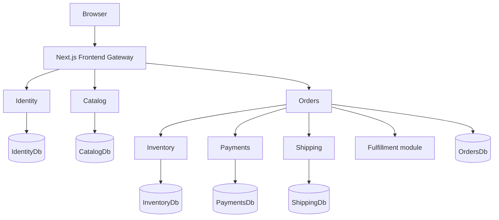

# Phase 0 — Architecture & Foundation

## Goal

Phase 0 establishes Luna's **service boundaries, application architecture, development environment, and engineering conventions**.

No complex commerce workflow is implemented yet. Phase 1 should be able to build the commerce flows without changing these fundamental boundaries.

## Implementation status

**Complete as of 2026-09-19.** This document describes the Phase 0 baseline and intentionally preserves the constraints that were established before commerce behavior was added. Subsequent work implemented the Phase 1 synchronous commerce flow and delivered several capabilities earlier than the original sequence, including OpenIddict-based authentication, service-to-service authorization, checkout idempotency, OpenTelemetry, and local SigNoz infrastructure. Those capabilities do not change the Phase 0 ownership and boundary decisions.

## Quick navigation

### Architecture & Boundaries

1. [Service Boundaries](#1-service-boundaries)
2. [System Architecture](#2-system-architecture)
3. [Database Architecture](#3-database-architecture)
4. [Repository Structure](#4-repository-structure)

### Application & API Design

1. [API Architecture](#5-api-architecture)
2. [Internal Service Architecture](#6-internal-service-architecture)
3. [Validation & Mapping](#7-validation--mapping)
4. [Errors & Exception Handling](#8-errors--exception-handling)

### Security, Configuration & Platform

1. [Logging & Request Tracking](#9-logging--request-tracking)
2. [Configuration & Secrets](#10-configuration--secrets)
3. [Authentication & Security](#11-authentication--security)
4. [Time & Identifiers](#12-time--identifiers)
5. [Health Checks](#13-health-checks)
6. [Observability](#14-observability)

### Engineering & Infrastructure

1. [Testing](#15-testing)
2. [Local Infrastructure](#16-local-infrastructure)
3. [Technology Baseline](#17-technology-baseline)
4. [CI/CD & Container Publishing](#18-cicd--container-publishing)

### Roadmap & Decisions

1. [Intentionally Deferred](#19-intentionally-deferred)
2. [Phase 0 Completion Criteria](#20-phase-0-completion-criteria)
3. [Confirmed Architectural Decisions](#confirmed-architectural-decisions)

---

## 1. Service Boundaries

Luna starts with six independent backend services:

| Service | Responsibility |
|---|---|
| **Identity** | Users, authentication, roles, authorization |
| **Catalog** | Products, descriptions, prices, availability |
| **Orders** | Carts, orders, checkout orchestration, order lifecycle |
| **Payments** | Payment state, attempts, provider integration |
| **Inventory** | Warehouses, stock, reservations |
| **Shipping** | Shipping methods, quotes, shipments, tracking |

**Fulfillment** initially remains a module inside Orders and is planned to become its own service in Phase 7.

### Boundary rules

Each service owns its:

- Domain and business rules
- Database and migrations
- API and contracts

Services never access another service's database or internal assemblies.

Cross-service communication uses **HTTP APIs initially** and **asynchronous messages where later phases introduce them**.

---

## 2. System Architecture

### Service topology



Phase 0–1 uses **synchronous HTTP/REST** to establish service interactions.

Event-driven messaging is introduced in Phase 2 on a local AWS emulator, which provides EventBridge, SQS, and SES. RabbitMQ and a hosted local emulator were both evaluated for that phase and rejected; the decision is recorded in the Phase 2 architecture document. Messaging complements HTTP; it does not replace it.

The eventual system uses both:

- **HTTP** when an immediate response is required.
- **Messages/events** when work can be decoupled or become eventually consistent.

### Frontend boundary

The browser sees one application boundary:

```text
                         PUBLIC
                           │
                           ▼
                    ┌─────────────┐
                    │   Browser   │
                    └──────┬──────┘
                           │
                           ▼
                    ┌─────────────┐
                    │   Next.js   │
                    │ Thin Gateway│
                    └──────┬──────┘
                           │
                    PRIVATE NETWORK
                           │
        ┌──────────────────┼──────────────────┐
        ▼                  ▼                  ▼
    Identity            Catalog             Orders
                                             │
                                  ┌──────────┼──────────┐
                                  ▼          ▼          ▼
                              Inventory   Payments   Shipping
```

The default Docker Compose configuration publishes **Next.js only**. Backend services are private network services.

Next.js forwards service contracts through same-origin paths such as:

```text
/api/services/catalog/...
/api/services/orders/...
```

Phase 0 uses a **thin gateway**, not a full BFF:

- No duplicate frontend DTO layer
- No cross-service aggregation
- No business orchestration
- No domain logic in Next.js

The backend APIs retain their own contracts and remain independently usable.

A full BFF can be introduced later if the customer UI or Operations Console demonstrates a concrete need for frontend-specific aggregation or DTOs.

---

## 3. Database Architecture

Each service owns an independent database:

```text
SQL Server
├── IdentityDb
├── CatalogDb
├── OrdersDb
├── PaymentsDb
├── InventoryDb
└── ShippingDb
```

Local development may host these databases on one SQL Server instance. Physical hosting does not change ownership.

### Rules

- Each service manages its own EF Core migrations.
- No cross-database foreign keys.
- No direct queries against another service's database.
- Cross-service references use opaque UUIDs.
- Services exchange data through APIs/messages rather than shared EF entities.

---

## 4. Repository Structure

```text
Luna/
├── src/
│   ├── Services/
│   │   ├── Identity/
│   │   ├── Catalog/
│   │   ├── Orders/
│   │   ├── Payments/
│   │   ├── Inventory/
│   │   └── Shipping/
│   └── Frontend/
├── tests/
│   ├── Identity/{Unit,Integration}/
│   ├── Catalog/
│   ├── Orders/
│   ├── Payments/
│   ├── Inventory/
│   ├── Shipping/
│   └── EndToEnd/
├── infrastructure/
│   └── docker-compose.yml
├── documentation/
├── AGENTS.md
├── README.md
└── Luna.sln
```

Each backend service is an independent .NET application.

There is no mandatory project/layer count. Layers such as `Application`, `Domain`, and `Infrastructure` are introduced when a service's complexity justifies them.

---

## 5. API Architecture

All services expose **ASP.NET Core REST APIs**.

### API conventions

- Resource-oriented REST
- Standard HTTP status codes
- Versioning beginning at `v1`
- OpenAPI for every service
- Swagger UI for exploration/testing
- Explicit request/response contracts
- Typed frontend API clients
- Consistent identifiers and errors

### API ownership

| API | Responsibility |
|---|---|
| Identity | Authentication, users, roles |
| Catalog | Products, search, filtering |
| Orders | Cart, checkout, orders |
| Payments | Payment authorization/state |
| Inventory | Stock and reservations |
| Shipping | Quotes, shipping, tracking |

API-breaking changes require a new version.

Services depend on **API contracts**, never another service's implementation.

### API implementation

- ASP.NET Core Controllers define the HTTP boundary.
- Controllers delegate to application commands/queries.
- Controllers contain no business logic.
- REST routes are resource-oriented.

---

## 6. Internal Service Architecture

Where service complexity warrants it:

```text
HTTP Request
     │
     ▼
Controller
     │
     ▼
Request Validation
     │
     ▼
Command / Query
     │
     ▼
Domain / Application Logic
     │
     ▼
Infrastructure / EF Core
     │
     ▼
Database
```

### CQRS

Luna uses **conceptual CQRS**:

- Commands change state.
- Queries retrieve state.
- Read/write responsibilities remain separate.

No CQRS framework is required.

### MediatR

**Not used initially.** It may be introduced later if genuine mediator-based decoupling becomes useful.

---

## 7. Validation & Mapping

### Request validation

Use **FluentValidation** for input concerns such as:

- Required fields
- Email format
- Quantity > 0
- Basic request constraints

### Business validation

Business rules remain in the owning application/domain:

- Cannot reserve more stock than available.
- Cannot cancel an already shipped order.
- Cannot authorize payment for an invalid order.

### Mapping

DTOs are mapped **manually**. AutoMapper is not used initially.

---

## 8. Errors & Exception Handling

All services use centralized exception handling.

Expected validation/business failures return structured errors.

Unexpected failures:

- Are logged.
- Include the correlation ID.
- Return a generic `500`.
- Never expose stack traces, database errors, or internal implementation details.

Example:

```json
{
  "code": "PRODUCT_NOT_FOUND",
  "message": "The requested product was not found.",
  "correlationId": "..."
}
```

| Status | Meaning |
|---|---|
| `400` | Invalid request |
| `401` | Unauthenticated |
| `403` | Unauthorized |
| `404` | Resource not found |
| `409` | Business conflict |
| `500` | Unexpected failure |

---

## 9. Logging & Request Tracking

All services use **Serilog structured logging**.

Useful fields include:

- Timestamp
- Log level
- Service
- Environment
- Correlation ID
- Request ID
- Operation
- Relevant entity IDs
- Exception details

Log meaningful application/business events rather than every method call.

Never log passwords, tokens, payment credentials, or secrets.

### Correlation IDs

Every incoming request receives or propagates a correlation ID.

The ID is:

- Included in logs.
- Returned in API errors.
- Propagated through synchronous service calls.

This establishes the foundation for distributed tracing later.

---

## 10. Configuration & Secrets

Configuration uses:

- ASP.NET Core configuration
- Environment-specific settings
- Environment variables
- Options pattern

Configuration covers database connections, service URLs, authentication, logging, and provider settings.

Secrets are never committed to source control.

Local secrets use excluded development configuration or `.env` files. Production secrets are supplied by the deployment environment in later phases.

---

## 11. Authentication & Security

### Identity responsibilities

```text
┌─────────────────────────────────────────────┐
│              Luna Identity                  │
│                                             │
│  ASP.NET Core Identity      OpenIddict      │
│  ───────────────────      ───────────────    │
│  Users                     OAuth 2.0        │
│  Passwords                 OpenID Connect   │
│  Roles                     Authorization    │
│  Claims                    Token protocol   │
│  Account lifecycle                          │
└─────────────────────────────────────────────┘
```

ASP.NET Core Identity manages **users, passwords, roles, claims, and account lifecycle**.

OpenIddict, introduced in Phase 1, provides the standards-based **OAuth 2.0 / OpenID Connect authorization server and token protocol**.

These are complementary technologies, not competing choices.

### Phase 0

Phase 0 uses the framework-provided Identity API endpoints as the initial authentication foundation:

```text
Register / Login
       │
       ▼
ASP.NET Core Identity API
       │
       ▼
Framework bearer authentication
       │
       ▼
Authenticated request
       │
       ▼
Role / policy authorization
```

OpenIddict is **not yet implemented**.

### Phase 1 target

```text
Browser
   │
   │ OpenID Connect
   ▼
Next.js
   │
   ▼
OpenIddict
   │
   ▼
ASP.NET Core Identity
   │
   ▼
Identity database
```

Next.js is the target OIDC client and server-side session boundary.

The browser should maintain a secure session with Next.js rather than receiving backend access tokens directly.

The intended API flow is:

```text
Browser
   │
   │ Secure session cookie
   ▼
Next.js
   │
   │ Authorization: Bearer <access-token>
   ▼
Private backend API
```

Backend services validate access tokens and enforce authorization; they do not issue user access tokens.

### Token responsibilities

| Credential | Purpose | Primary consumer |
|---|---|---|
| Session cookie | Maintain browser session | Browser / Next.js |
| ID token | Represent authenticated identity to the OIDC client | Next.js |
| Access token | Authorize API requests | Backend APIs |
| Refresh token | Obtain new access tokens | Server-side auth/session layer |

The backend authorization model does not depend on a particular access-token serialization format.

### Security rules

- Passwords are never stored in plaintext.
- Authentication is centralized in Identity.
- Authorization uses roles/policies.
- Tokens and secrets are never logged.
- Client-supplied user IDs are never treated as proof of identity.
- Backend services are not publicly exposed by default.
- Internal write APIs authenticate service callers with short-lived OpenIddict client-credentials tokens and least-privilege scopes. The Orders client secret is supplied by deployment configuration, not source control.

Deferred to the dedicated security phase:

- MFA
- Password reset
- Email verification
- Refresh-token rotation
- Security auditing
- Advanced security hardening

---

## 12. Time & Identifiers

### Time

- Store timestamps in UTC.
- Exchange timestamps as ISO 8601 UTC.
- Convert to local time only in the presentation layer.
- Domain logic must not depend on server local time.

### Identifiers

- Services generate and own their IDs.
- Use UUIDs for distributed identifiers.
- IDs are opaque and contain no business meaning.

---

## 13. Health Checks

Every service exposes a basic health endpoint.

Phase 0 verifies that the application is running.

Later phases expand readiness checks to dependencies such as:

- Databases
- The local AWS emulator (EventBridge, SQS, SES)
- Other infrastructure services

---

## 14. Observability

Phase 0 establishes the foundation:

- Structured logging
- Service identification
- Correlation IDs
- Appropriate request/response logging
- Health checks
- Consistent error logging

Full observability is deferred to Phase 8:

- OpenTelemetry
- Distributed tracing
- Metrics
- Log aggregation
- Dashboards
- Cross-service visualization

---

## 15. Testing

Testing follows service ownership.

### Unit tests

Test domain behavior, application logic, and business rules.

### Integration tests

Test:

- API + database
- EF Core behavior
- Migrations
- Service boundaries

Use **Testcontainers** with real SQL Server containers.

### End-to-end tests

Test complete cross-service workflows.

Cross-service behavior belongs in contract/E2E testing rather than unit tests.

---

## 16. Local Infrastructure

Phase 0 provides a repeatable local environment using:

- .NET
- Next.js / React
- SQL Server
- Docker
- Docker Compose

The environment supports independent service configuration and database migrations.

**Messaging is intentionally not included yet. Phase 2 adds a local AWS emulator (EventBridge, SQS, SES), not RabbitMQ.**

---

## 17. Technology Baseline

| Area | Technology | Purpose / decision |
|---|---|---|
| Backend | .NET 8 / ASP.NET Core | Service runtime |
| API | REST / OpenAPI | Service contracts |
| API style | ASP.NET Core Controllers | HTTP boundary |
| Identity | ASP.NET Core Identity | Users, passwords, roles, lifecycle |
| Authorization server | OpenIddict | Introduced in Phase 1 |
| ORM | EF Core | Persistence |
| Database | SQL Server | Service databases |
| Architecture | Conceptual CQRS | Separate commands and queries |
| Mediator | None initially | Avoid unnecessary indirection |
| Validation | FluentValidation + domain validation | Request and business validation |
| Mapping | Manual | Explicit DTO mapping |
| Logging | Serilog | Structured logging |
| Testing | xUnit + FluentAssertions | Unit/integration assertions |
| Mocking | Moq | Unit-test doubles |
| Integration | Testcontainers | Real dependency testing |
| Frontend | Next.js + React + TypeScript | Customer web application and gateway |
| Server state | TanStack Query | API data fetching/caching |
| HTTP client | Axios | Initial typed-client transport |
| Configuration | ASP.NET Core Options | Configuration binding |
| Health | ASP.NET Core Health Checks | Health endpoints |
| Containers | Docker + Docker Compose | Local environment |

---

## 18. CI/CD & Container Publishing

Phase 0 establishes the initial CI/CD foundation: code merged into `main` must be buildable, testable, and able to run as the full distributed system before container images are published.

### Continuous Integration

The `Luna CI` workflow runs on pull requests and pushes to `main`, and verifies:

- .NET solution restore, Release build, unit tests, and integration tests
- Frontend dependency install, lint, and production build
- Docker Compose startup, frontend Swagger availability, and service health through the Next.js gateway

Test projects stay separate from production projects and are organized by service/feature rather than one test project per service:

```
tests/
├── Unit/
│   └── Luna.UnitTests.csproj
└── Integration/
    └── Luna.IntegrationTests.csproj
```

### Container Publishing

A separate `Luna Docker Publish` workflow publishes images only after `Luna CI` succeeds on `main`, checking out the exact commit CI tested rather than whatever is currently on `main`. Each service image (`luna-frontend`, `luna-identity`, `luna-catalog`, `luna-orders`, `luna-payments`, `luna-inventory`, `luna-shipping`) receives two tags: an immutable `<git-sha>` tag and a `latest` tag.

### Registry

Images are published to GitHub Container Registry as `ghcr.io/<repository-owner>/luna-<service>`. Images contain no runtime credentials or environment-specific secrets; runtime configuration remains the deployment environment's responsibility.

### Phase 0 Scope

The pipeline is intentionally simple: one CI workflow, one Docker publishing workflow, GitHub-hosted runners, GHCR, all images built from a successful `main` build, SHA/`latest` tags, and Docker Compose as the system-level smoke test.

### Deferred CI/CD Improvements

Deferred until they provide a concrete benefit: Docker layer caching, active health/readiness polling (replacing fixed Compose delays), building only changed services, multi-platform images, vulnerability scanning, image signing/attestation, automated deployment and rollback, environment-specific pipelines, release/version-based tags, infrastructure-as-code, and advanced CI parallelization.

> **First verify the system, then publish the exact verified commit as container images. Add deployment and supply-chain complexity only when Luna's later phases require it.**

---

## 19. Intentionally Deferred

Phase 0 deliberately does not solve distributed reliability or complex commerce workflows.

Deferred to later phases:

- Complete checkout workflow
- Emulated messaging (EventBridge, SQS, SES) and asynchronous consumers
- Transactional Outbox
- Retries and timeouts
- Resilience policies
- Idempotency
- Dead-letter queues
- Simulated processing delays
- Failure injection
- OpenTelemetry and metrics
- Operations dashboard
- Service redundancy
- Chaos testing
- Production-like deployment
- Advanced authentication/security hardening
- Fulfillment service extraction

---

## 20. Phase 0 Completion Criteria

Phase 0 is complete when:

- [x] Six service boundaries exist.
- [x] Frontend project exists.
- [x] Each service has independent persistence ownership.
- [x] Databases can be created and migrated independently.
- [x] Docker Compose starts the local environment.
- [x] Every service exposes a health endpoint.
- [x] REST/OpenAPI conventions are established.
- [x] Centralized exception handling exists.
- [x] Structured logging and correlation IDs work.
- [x] Configuration/secrets conventions are established.
- [x] Identity framework endpoints support registration/login and configured roles.
- [x] The customer frontend reaches backend APIs through the Next.js gateway.
- [x] Backend services are not directly published by default Compose configuration.
- [x] Unit and integration test foundations exist.
- [x] Service boundaries prevent direct database/internal-assembly dependencies.
- [x] Phase 1 can begin without redesigning the architecture.

### Current status

The repository satisfies the Phase 0 baseline in both structure and runtime validation. The project has six independent backend services, a Next.js frontend gateway, a working Docker environment, health checks, Swagger/OpenAPI exposure, correlation-ID logging, identity endpoints, CI/container publishing, and a test foundation. Phase 1 proceeded without redesigning the core architecture and is now in closure; the current project position is tracked in the [roadmap](../../roadmap.md).

---

## Confirmed Architectural Decisions

1. **Six services:** Identity, Catalog, Orders, Payments, Inventory, Shipping.
2. **Fulfillment remains inside Orders until Phase 7.**
3. **Each service owns its database, migrations, domain, and API.**
4. **No cross-service database access or shared internal assemblies.**
5. **Backend services are private network services by default.**
6. **Next.js is the public HTTP boundary.**
7. **Next.js is a thin gateway, not a full BFF initially.**
8. **Backend APIs retain their own DTO/API contracts.**
9. **BFF-specific DTO mapping/aggregation is introduced only when a concrete need appears.**
10. **REST/HTTP is the primary communication mechanism in Phase 0–1.**
11. **Messaging begins in Phase 2 on a local AWS emulator (EventBridge, SQS, SES) rather than RabbitMQ; messaging complements HTTP rather than replacing it.**
12. **ASP.NET Core Identity manages users, passwords, roles, and account lifecycle.**
13. **OpenIddict provides the future OAuth 2.0/OpenID Connect authorization server.**
14. **Next.js is the target OIDC client and server-side session boundary.**
15. **Backend services validate access tokens; they do not issue them.**
16. **OpenAPI defines service contracts.**
17. **Conceptual CQRS is used without MediatR initially.**
18. **FluentValidation handles request validation; domain/application logic handles business rules.**
19. **DTO mapping is manual; no AutoMapper initially.**
20. **Centralized exception handling, structured logging, and correlation IDs are foundational.**
21. **UTC timestamps and opaque UUIDs are used across services.**
22. **Testcontainers is used for database integration testing.**
23. **Docker Compose provides the local environment.**
24. **Advanced reliability, observability, security, and redundancy are intentionally introduced in later phases.**
