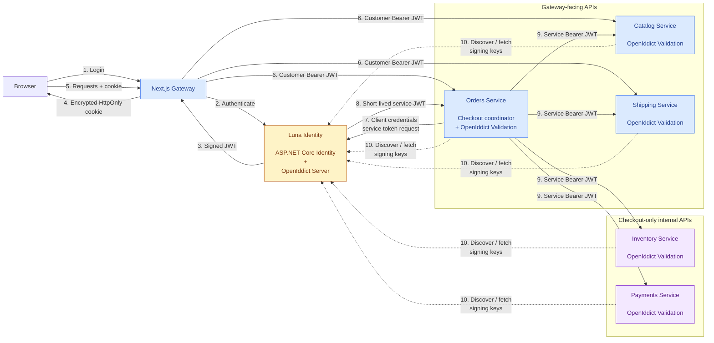

# Phase 1 Architecture

## Contents

- [1. Architectural Goals](#1-architectural-goals)
- [2. Service Boundaries](#2-service-boundaries)
- [3. Communication and Gateway](#3-communication-and-gateway)
- [4. Database Ownership](#4-database-ownership)
- [5. Backend Layering](#5-backend-layering)
- [6. Domain Model](#6-domain-model)
- [7. Read and Write Architecture](#7-read-and-write-architecture)
- [8. Frontend Architecture](#8-frontend-architecture)
- [9. Authentication Architecture](#9-authentication-architecture)
- [10. Checkout Coordination](#10-checkout-coordination)
- [11. Persistence](#11-persistence)
- [12. Testing Architecture](#12-testing-architecture)
- [13. Architectural Decisions](#13-architectural-decisions)
- [14. Deferred Architecture](#14-deferred-architecture)
- [15. Architecture Implementation Checklist](#15-architecture-implementation-checklist)

The detailed Phase 1 Luna Ops fulfillment and shipment boundary is documented separately in [phase-1-ops-architecture.md](phase-1-ops-architecture.md).

# 1. Architectural Goals

Phase 1 architecture should preserve the service boundaries established in Phase 0, keep databases independently owned, keep backend services private, allow Orders to coordinate checkout, keep Fulfillment inside Orders, and leave a clean path for asynchronous communication in Phase 2.

## Implementation status

**Substantially implemented; closure pending cross-service verification as of 2026-09-26.** The current implementation follows this architecture for the synchronous commerce path, customer shipment tracking, and the initial Luna Ops fulfillment/shipment workflow, including the Next.js thin gateway, service-owned contracts and persistence, Orders application orchestration, local JWT validation, authenticated service clients, checkout idempotency, and CQRS-style read/write boundaries. OpenTelemetry and local SigNoz infrastructure are also implemented as an early cross-cutting capability. The remaining Phase 1 gaps are the complete real-boundary checkout failure matrix and Docker-backed quality-gate execution.

# 2. Service Boundaries

### Structural invariants

Luna uses the following structural rules when adding or reorganizing code:

1. Business services use `{Service}.Api`, `{Service}.Application`, `{Service}.Contracts`, `{Service}.Domain`, and `{Service}.Infrastructure` projects where the service boundary requires them.
2. Application code is organized by feature or capability.
3. Domain projects contain business entities and domain rules.
4. Contracts projects contain external and API contracts owned by that service.
5. `Luna.Contracts` contains only genuinely cross-service contracts.
6. Infrastructure contains persistence and external integration implementations.
7. Repository interfaces belong to the Application abstraction; repository implementations belong to Infrastructure.
8. Repositories do not orchestrate business workflows.
9. Application handlers own use-case orchestration.
10. Shared code requires explicit justification and should not be introduced merely to avoid local duplication.

Identity is a deliberate exception to the project layout rule. It currently uses one `Identity.csproj` with Application, Controllers, Domain, Infrastructure, and Migrations folders because its OpenIddict identity host predates the five-project service template. Its internal folders preserve the same responsibility boundaries. New services should follow the standard service layout.

## Checkout orchestration

### SPEC-ARCH-001 - Orders owns checkout

**Given** a customer submits checkout

**Then** Orders coordinates the checkout workflow.

Orders may call:

* Catalog
* Shipping
* Inventory
* Payments
* Fulfillment

Other services must not orchestrate the checkout process.

---

### SPEC-ARCH-002 - Service ownership

Each service owns:

* its domain
* its application logic
* its persistence
* its migrations
* its API

No service may directly access another service's internal implementation.

---

### SPEC-ARCH-003 - Database isolation

**Given** two services

**Then** neither service may query the other's database.

Cross-service relationships are represented using IDs and service APIs.

---

# 3. Communication and Gateway

Phase 1 uses synchronous HTTP. Next.js is the public HTTP boundary and thin gateway. The browser does not directly address Docker service names or private service URLs.

```text
Browser -> Next.js -> backend service
Orders -> Catalog, Shipping, Inventory, Payments
```

RabbitMQ is deferred to Phase 2.

# 4. Database Ownership

## Database Schema

Each service continues to own its own database.

## CatalogDb

```text
Category
Product
ProductImage
```

## OrdersDb

```text
Cart
CartItem
Order
OrderItem
ShippingAddress
```

## PaymentsDb

```text
Payment
PaymentAttempt
```

## InventoryDb

```text
Warehouse
Stock
InventoryReservation
```

## ShippingDb

```text
ShippingMethod
ShippingQuote
Shipment
TrackingEvent
```

Identity uses the ASP.NET Core Identity schema.

---
## Database Rules

## SPEC-DB-001 - Migrations

Database schema changes use EF Core migrations.

`EnsureCreated` is not used for application databases.

---

## SPEC-DB-002 - Migration startup

Services apply pending migrations before executing baseline seed logic.

Schema evolution belongs to migrations.

Baseline data belongs to seed logic.

---

## SPEC-DB-003 - Cross-service relationships

No cross-database foreign keys are created.

Cross-service relationships are represented using IDs.

---

# 5. Backend Layering

## Application Structure

Each backend service uses project-level layer boundaries when it owns meaningful
application, domain, and infrastructure behavior:

```text
Service/
+---- Service.Api/            -> HTTP host and controllers
+---- Service.Application/    -> commands, queries, handlers, ports
+---- Service.Contracts/      -> public API request/response contracts
+---- Service.Domain/         -> aggregates and business rules
+---- Service.Infrastructure/ -> EF Core, repositories, migrations, adapters
```

The dependency direction is inward:

```text
Api -> Application, Contracts, Infrastructure
Infrastructure -> Application, Domain
Application -> Contracts, Domain
Domain -> no service project dependencies
Contracts -> no service project dependencies
```

Simple services may remain a single project only while they have not yet
developed meaningful layer boundaries. They must be split before application
or domain behavior is added to the host project.

## Controllers

Controllers handle:

* HTTP routing
* request binding
* authentication/authorization metadata
* HTTP response mapping

Controllers do not contain:

* business rules
* EF queries
* checkout orchestration
* inventory calculations
* payment decisions
* domain state transitions

---

## Application

Application code coordinates use cases.

Examples:

```text
Checkout
ReserveInventory
ReleaseReservation
AuthorizePayment
CreateShipment
GetOrders
GetCart
```

---

## Domain

Domain code owns business behavior such as:

* order state transitions
* inventory invariants
* payment state
* domain concepts

---

## Infrastructure

Infrastructure owns:

* EF Core
* database configuration
* migrations
* seed data
* HTTP clients
* external integrations

---

# 6. Domain Model

The current bounded-context model is:

```text
Catalog: Product, Category, ProductImage
Orders: Cart, CartItem, Order, OrderItem, ShippingAddress
Payments: Payment, PaymentAttempt
Inventory: Stock, InventoryReservation
Shipping: ShippingMethod, ShippingQuote, Shipment, TrackingEvent
```

Fulfillment remains a module inside Orders during Phase 1.

## Domain-Driven Design Boundaries

Aggregate roots protect invariants within each bounded context. An aggregate is changed through its root; child entities should not be modified independently.

```text
Catalog:   Product -> ProductImage
Orders:    Cart -> CartItem
           Order -> OrderItem, ShippingAddress
Inventory: Stock -> InventoryReservation
Payments:  Payment -> PaymentAttempt
Shipping:  Shipment -> TrackingEvent
```

Important ownership rules include:

* `Product` owns its images, including image ordering and lifecycle.
* `Cart` owns item quantities and add/remove behavior.
* `Order` owns item price snapshots, address snapshots, and valid status transitions.
* `Stock` owns availability and reservation invariants, including concurrency-safe reserve and release behavior.
* `Payment` owns authorization state and payment-attempt history.
* `Payment` uses a unique order identifier and optimistic concurrency token to prevent conflicting aggregate writes.
* Payment authorization uses a stable order-based idempotency key so concurrent provider requests produce one deterministic result.
* `Shipment` owns its tracking lifecycle.

The most useful value objects are `Money`, `Sku`, `CategorySlug`, `Quantity`, and `ShippingAddress`. They should be introduced when related write behavior requires stronger validation; they are not required for every read model.

Domain services are reserved for behavior that does not naturally belong to one aggregate, such as shipping-rate calculation. Checkout coordination is an Orders application responsibility, not a domain service, because it coordinates Catalog, Shipping, Inventory, Payments, and Fulfillment. HTTP clients, provider adapters, EF Core repositories, and read projections remain outside the domain layer.

# 7. Read and Write Architecture

## Read and Write Behavior

Application features organize code by business capability. Queries and commands are grouped by feature, while read and write repository interfaces explicitly identify their CQRS responsibility.

```text
Feature/
├── FeatureQueries.cs
├── FeatureCommands.cs
├── IFeatureReadRepository.cs
└── IFeatureWriteRepository.cs
```

Query handlers read through read repositories and return read models. Command handlers load and modify domain aggregates through write repositories. A feature that is read-only may omit `FeatureCommands.cs` and `IFeatureWriteRepository.cs`; a feature that is write-only may omit the query files.

## Reads

Read repositories project directly to Application DTOs/read models.

```text
Database
   v
EF Core projection
   v
Application DTO
   v
Handler
   v
Controller
```

Read operations should not materialize domain entities unnecessarily.

---

## Writes

Write operations may load domain entities when business behavior is required.

```text
Request
   v
Application
   v
Load domain state
   v
Execute domain behavior
   v
Persist
```

---

# 8. Frontend Architecture

The frontend uses Next.js, React, TypeScript, Axios, and TanStack Query.

- Catalog and product content are Server Components where practical.
- Cart, checkout, shipping quotes, and interactive inventory availability use Client Components with TanStack Query.
- Centralized API clients keep HTTP calls out of UI components.
- URL parameters remain the source of truth for catalog filters and pagination.

# 9. Authentication Architecture

Luna uses stateless JWT authentication. ASP.NET Core Identity manages users, passwords, roles, and account-related functionality. OpenIddict is used in the Luna Identity service to provide OAuth 2.0 / OpenID Connect server functionality and issue signed JWT access tokens.

OpenIddict Server is responsible for token issuance, and the Identity service acts as the trusted token issuer. It exposes the token and discovery endpoints, including signing key information. Backend services use OpenIddict Validation to discover and cache the trusted signing keys, then validate incoming JWT access tokens and their claims locally. They do not need to contact Identity for each request. Discovery also provides a path for signing-key rotation without manually distributing a public key through every service's configuration.

The shared `Luna.Contracts` project defines the authentication protocol values used across the system, including the API audience and JWT claim names. The shared `Luna.Authentication` class library contains the reusable OpenIddict validation bootstrap and validation scheme details. Consuming services reference this library and opt into validation explicitly; they retain ownership of endpoint authorization and service-specific policies. Identity keeps its OpenIddict Server configuration local because it is the token issuer rather than a token consumer.

Catalog enables JWT validation before it has protected endpoints so its hosting and security pipeline is ready for future authorization without making current catalog reads private. Orders protects cart endpoints and derives the customer ID from the validated token subject. Subject claim parsing is shared, while cart ownership remains an Orders application concern.

Next.js acts as the browser-facing gateway and stores the JWT in an encrypted, `HttpOnly`, `Secure` cookie. Cookie encryption provides confidentiality and prevents the browser from inspecting the stored token; it is separate from JWT validation. JWT authenticity and integrity come from signature verification using Luna Identity's trusted signing key.

When Next.js calls backend services, it sends the customer's JWT as a Bearer token. Backend services independently validate the JWT signature and claims.

Backend services also authenticate to one another. Orders is the checkout coordinator and uses the OAuth 2.0 client-credentials grant to obtain a short-lived service access token from Identity. It sends that token as a Bearer token when calling Catalog, Inventory, Payments, and Shipping. Each receiving service validates the service token locally using the same OpenIddict signing keys and applies its own service-specific authorization policy. Service credentials and token exchange are kept server-side; they are never exposed to the browser.

No server-side session store, Redis, or sticky sessions are required.



# 10. Checkout Coordination

Orders owns checkout orchestration. The intended synchronous sequence is:

```text
Orders -> Catalog: validate products and prices
Orders -> Shipping: calculate quote
Orders: create Pending order and snapshots
Orders -> Inventory: reserve
Orders -> Payments: authorize
Orders: Confirmed
Orders: Fulfillment.Prepare
Orders -> Shipping: create shipment
```

# 11. Persistence

Services use SQL Server and EF Core. EF Core migrations own schema evolution; startup applies pending migrations before separate seed logic runs. Seed data belongs in infrastructure rather than controllers or root-level service files.

# 12. Testing Architecture

## Testing Requirements

## SPEC-TEST-001 - Business behavior

Tests must cover meaningful business behavior rather than only implementation details.

Important examples include:

* order state transitions
* inventory reservation
* insufficient inventory
* concurrent reservation
* payment failure
* reservation release
* price snapshots
* shipping failure
* checkout orchestration

---

## SPEC-TEST-002 - Catalog reads

Catalog integration tests must verify real EF Core behavior such as:

* filtering
* search
* ordering
* relationships
* image ordering
* DTO projection
* not-found behavior

These tests should use real SQL Server/Testcontainers rather than mocking EF Core query translation.

---

## SPEC-TEST-003 - Cross-service behavior

Cross-service workflows are verified through integration/E2E tests.

Unit tests should not attempt to prove that the distributed system works by mocking every service.

---

## SPEC-TEST-004 - Coverage

Coverage is collected as a quality and regression signal.

Coverage does not have an arbitrary minimum threshold in Phase 1.

Tests should prioritize meaningful behavior and decision branches.

---

The repository also separates unit, integration, and smoke tests under the centralized tests/ structure. CI runs backend and frontend tests and a Docker Compose health smoke check.

# 13. Architectural Decisions

## Decisions

1. Orders owns checkout orchestration.
2. Phase 1 communication is synchronous HTTP.
3. RabbitMQ begins in Phase 2.
4. Fulfillment remains inside Orders until Phase 7.
5. Each service owns its database.
6. No cross-service database access is permitted.
7. Catalog owns current product prices.
8. Cart does not lock prices.
9. Orders snapshots prices during checkout.
10. Shipping owns shipping calculation.
11. Orders snapshots shipping cost.
12. Inventory owns stock and reservations.
13. Inventory reservation must be concurrency-safe.
14. Distributed locks are not required.
15. Payment authorization occurs only after successful inventory reservation.
16. Payment failure releases inventory.
17. Payments supports authorization only.
18. The fake payment provider is deterministic.
19. Phase 1 has exactly one shipment per order.
20. Shipment failure results in `ShippingPendingRetry`.
21. Automatic retry is deferred.
22. Customers cannot cancel orders.
23. Next.js remains the public frontend boundary.
24. Backend services remain private.
25. The browser does not directly address internal service URLs.
26. TanStack Query manages interactive frontend server state.
27. Catalog/product content is server-first where practical.
28. Controllers remain thin.
29. Application code coordinates use cases.
30. Domain code owns business behavior.
31. Infrastructure owns persistence and external integrations.
32. Read repositories project directly to Application DTOs/read models.
33. Writes use domain entities when domain behavior is required.
34. EF Core migrations own schema evolution.
35. Seed logic owns baseline data.
36. Phase 1 does not introduce a shared cross-service domain library.
37. Phase 1 does not introduce a full BFF.
38. Phase 1 does not attempt to solve distributed reliability.
39. Authentication protocol values are shared through `Luna.Contracts`.
40. JWT validation bootstrap is shared through the `Luna.Authentication` class library, not a deployable service.
41. Identity remains the only token issuer.
42. Backend services validate JWTs locally using discovered and cached signing keys.
43. Authorization policies remain service-owned even when validation setup is shared.
44. Cart access is authorized per customer using the token subject claim.
45. Phase 1 Luna Ops uses the ownership and orchestration rules in [phase-1-ops-architecture.md](phase-1-ops-architecture.md); the broader Operations Console remains deferred.

# 14. Deferred Architecture

Phase 2 and later work includes RabbitMQ, asynchronous consumers, transactional outbox, retries, compensation, advanced operations tooling, redundancy, chaos testing, and extraction of Fulfillment into its own service.

Distributed tracing and metrics are no longer deferred at the foundation level: OpenTelemetry, OTLP export, local SigNoz, host metrics, and a service-health dashboard are implemented. The remaining deferred work is the operational use of that telemetry, including queue and failure workflows, operator controls, and the Phase 9 Operations Console.

# 15. Architecture Implementation Checklist

## Service boundaries

- [x] Orders is the only service that orchestrates checkout.
- [x] Each service owns its domain, application logic, persistence, migrations, and API.
- [x] Services communicate through contracts and APIs rather than internal implementation details.
- [x] No service directly accesses another service's database.

## Domain-Driven Design

- [x] Aggregate roots are identified and documented for each implemented bounded context.
- [x] `Product` owns `ProductImage` and controls image ordering and lifecycle.
- [x] `Cart` owns `CartItem` and controls quantity and item changes.
- [x] Aggregate child entities cannot be modified independently through application use cases.
- [x] `Order` owns `OrderItem` and `ShippingAddress` snapshots and controls valid state transitions.
- [x] `Stock` owns inventory reservations and enforces availability and concurrency invariants.
- [x] `Payment` owns payment attempts and authorization state.
- [x] Payment persistence enforces unique order ownership and optimistic concurrency.
- [x] Payment provider authorization is idempotent for repeated authorization keys.
- [x] `Shipment` owns tracking events and its shipment lifecycle.
- [ ] Value objects are introduced where they protect meaningful domain rules, especially money, quantity, SKU, and address data.
- [ ] Domain services are used only for behavior that does not naturally belong to one aggregate.
- [x] Checkout coordination remains in the Orders application layer rather than becoming a domain service.

## Layering and persistence

- [x] Controllers remain limited to HTTP concerns and response mapping.
- [x] Application services coordinate use cases and cross-service calls.
- [x] Domain code owns business rules and state transitions.
- [x] Infrastructure contains EF Core, migrations, HTTP clients, and external-provider adapters.
- [x] Read repositories project directly to read DTOs without unnecessarily materializing aggregates.
- [x] Write operations load and modify aggregates when business behavior is required.

## Verification

- [x] Aggregate invariants have focused unit tests.
- [x] Persistence behavior has integration tests against real database infrastructure.
- [ ] Cross-service workflows have complete integration or end-to-end coverage (the Orders/Shipping lifecycle now uses real HTTP test servers; checkout still substitutes downstream HTTP clients with test handlers).
- [x] Architecture changes are reviewed against the bounded-context and ownership rules above.
