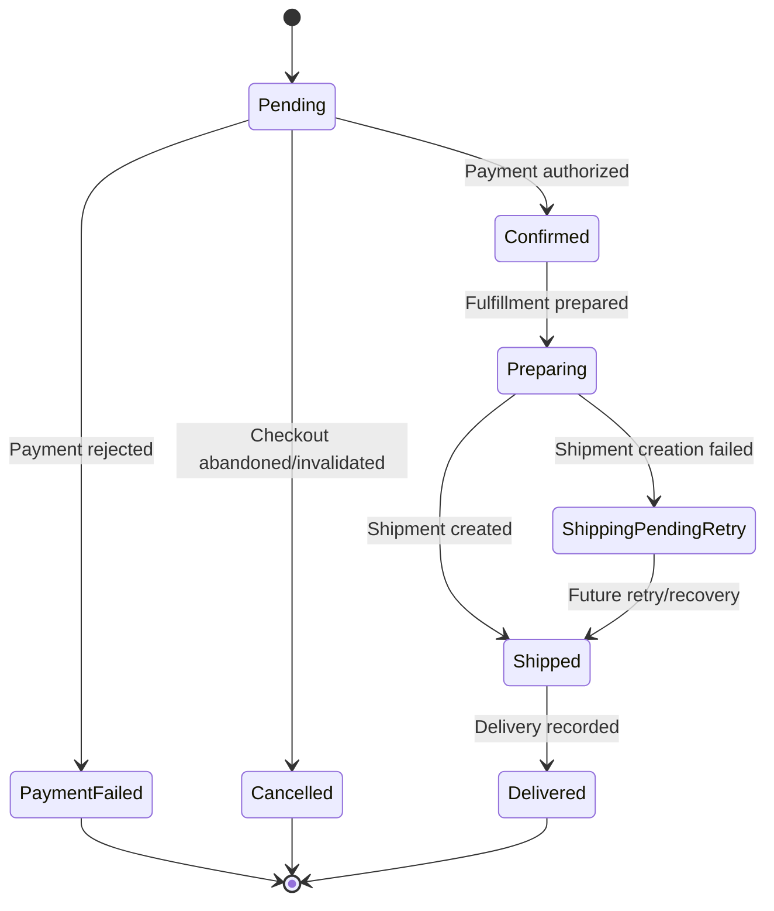
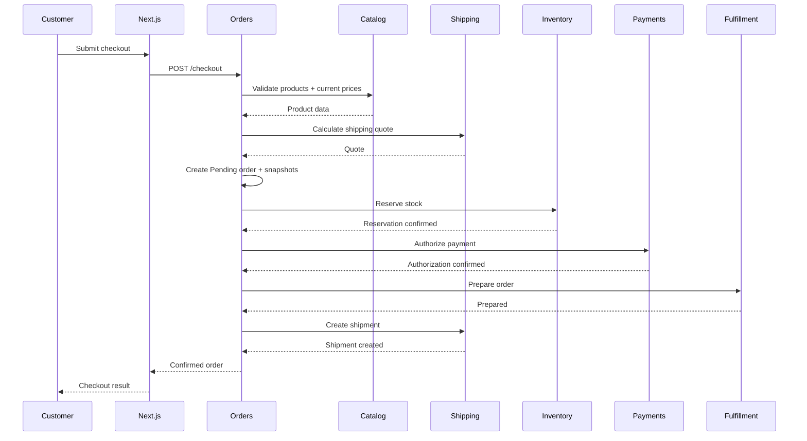
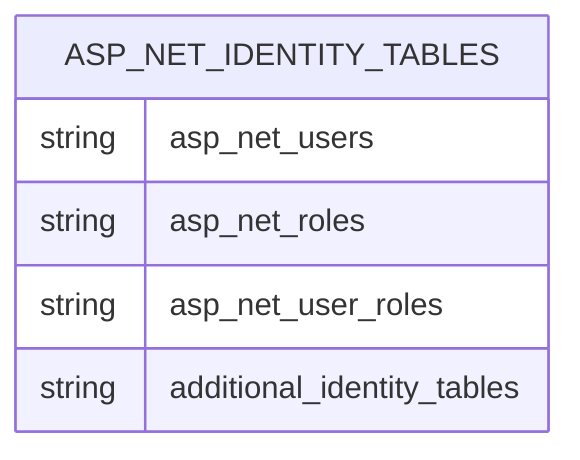
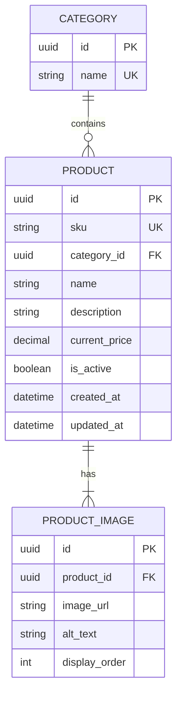
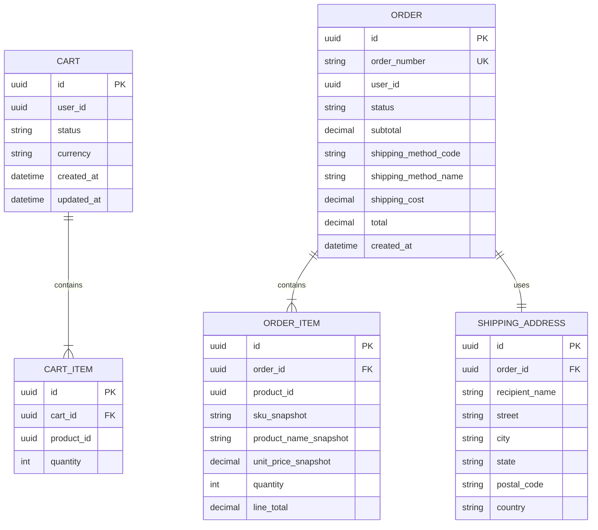
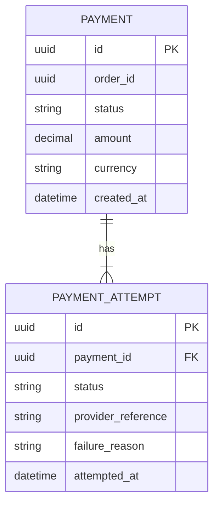
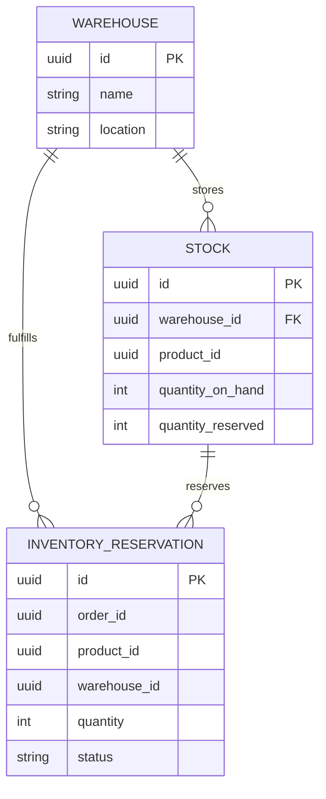
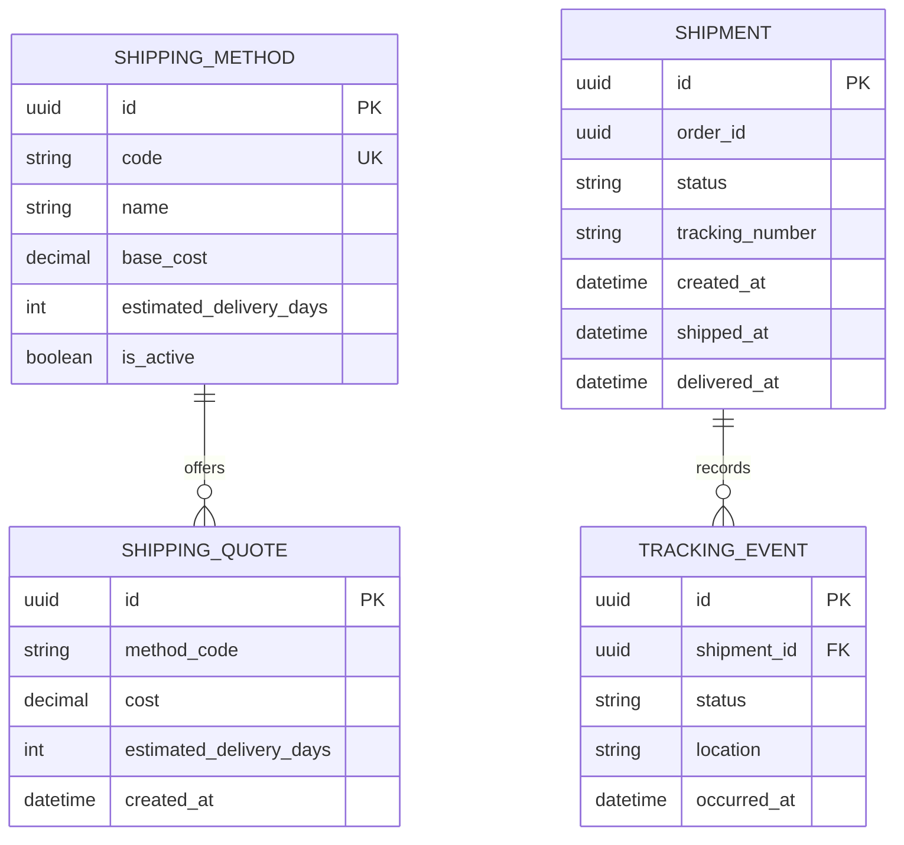
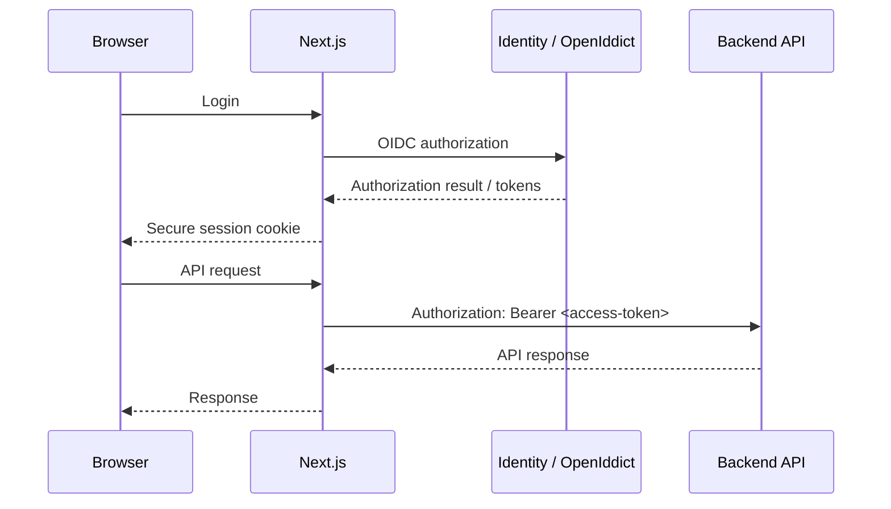

# Phase 1 — Basic Commerce Flow

## Scope

Phase 1 delivers the first complete customer commerce flow:

```text
Browse products
      ↓
    Cart
      ↓
   Checkout
      ↓
 Pending Order
      ↓
Inventory reservation
      ↓
Payment authorization
      ↓
Confirmed Order
      ↓
Fulfillment
      ↓
Shipment
      ↓
Delivered
```

Phase 1 focuses on a **working, deterministic happy path** with a small set of explicit failure outcomes.

Communication is synchronous HTTP. RabbitMQ, retries, dead-letter queues, transactional outbox processing, simulated delays, idempotency, compensation, and advanced recovery are later-phase concerns.

**Orders owns checkout orchestration** and coordinates Catalog, Shipping, Inventory, Payments, and the Fulfillment module.

---

## Quick Navigation

### Commerce Flow
1. [Phase 1 Assumptions](#1-phase-1-assumptions)
2. [Order Lifecycle](#2-order-lifecycle)
3. [Checkout Workflow](#3-checkout-workflow)
4. [Failure Behavior](#4-failure-behavior)

### Data & Service Contracts
5. [Database Entity Model](#5-database-entity-model)
6. [Database Ownership](#6-database-ownership)
7. [Cross-Service References](#7-cross-service-references)
8. [Service API Contracts](#8-service-api-contracts)

### Frontend
9. [Frontend Architecture](#9-frontend-architecture)
10. [Frontend Routes](#10-frontend-routes)
11. [Catalog & Search](#11-catalog--search)
12. [Cart](#12-cart)
13. [Checkout UI](#13-checkout-ui)
14. [Authentication & Authorization](#14-authentication--authorization)
15. [Frontend State, Loading & Errors](#15-frontend-state-loading--errors)

### Correctness & Constraints
16. [Inventory Reservation](#16-inventory-reservation)
17. [Pricing & Snapshots](#17-pricing--snapshots)
18. [Payments](#18-payments)
19. [Shipping](#19-shipping)
20. [Fulfillment](#20-fulfillment)

### Scope Boundaries
21. [Intentionally Not Solved in Phase 1](#21-intentionally-not-solved-in-phase-1)
22. [Phase 1 Completion Criteria](#22-phase-1-completion-criteria)
23. [Confirmed Decisions](#23-confirmed-decisions)

---

# 1. Phase 1 Assumptions

- Identity, Catalog, Orders, Payments, Inventory, and Shipping are separate application boundaries.
- Each application owns its own database and data.
- Fulfillment is an Orders module in Phase 1 and can become a separate service in Phase 7.
- IDs are shared as opaque references between services; cross-database foreign keys are not used.
- Orders stores immutable snapshots of product prices and shipping costs at checkout.
- The cart does not lock product prices.
- Catalog owns the current product price until checkout.
- Shipping calculates the shipping quote at checkout; Orders stores the returned cost as a snapshot.
- Inventory reserves available stock without warehouse allocation or split-fulfillment logic.
- Users are stored in `IdentityDb` and receive roles such as `Customer` and `Admin`.
- A Phase 1 order has exactly one shipment.
- Customers cannot cancel orders.
- Payments supports authorization only. Capture, void, and refunds are later capabilities.
- Phase 1 uses synchronous HTTP between services.
- RabbitMQ is introduced in Phase 2; messaging complements HTTP rather than replacing it.

---

# 2. Order Lifecycle

Orders owns the order lifecycle.



### State meanings

| State | Meaning |
|---|---|
| `Pending` | Order exists and checkout is being completed. |
| `Confirmed` | Inventory is reserved and payment has been authorized. |
| `PaymentFailed` | Payment authorization failed; reservation has been released. |
| `Preparing` | Fulfillment has accepted/prepared the order. |
| `ShippingPendingRetry` | Shipment creation failed; shipment creation requires future recovery/retry. |
| `Shipped` | Shipment exists and the order has shipped. |
| `Delivered` | Delivery has been recorded. |
| `Cancelled` | Order was invalidated/abandoned before confirmation. |

### Transition ownership

| Transition | Owner | Trigger |
|---|---|---|
| → `Pending` | Orders | Checkout creates the order |
| `Pending` → `Confirmed` | Orders | Payment authorization succeeds |
| `Pending` → `PaymentFailed` | Orders | Payment authorization fails |
| `Pending` → `Cancelled` | Orders | Checkout cannot proceed and the order is invalidated |
| `Confirmed` → `Preparing` | Orders / Fulfillment module | Fulfillment prepares the order |
| `Preparing` → `Shipped` | Orders / Shipping | Shipment is successfully created |
| `Preparing` → `ShippingPendingRetry` | Orders | Shipment creation fails |
| `ShippingPendingRetry` → `Shipped` | Orders / Shipping | Later recovery successfully creates shipment |
| `Shipped` → `Delivered` | Orders / Shipping | Delivery is recorded |

### Why `ShippingPendingRetry`?

`ShippingPending` sounds like a normal intermediate state in the happy path. The Phase 1 state specifically means:

> **Shipment creation failed and the order is waiting for a future retry/recovery mechanism.**

Therefore `ShippingPendingRetry` is more explicit.

It is still a temporary state. Automatic retry does **not** exist in Phase 1; later phases implement the recovery mechanism.

---

# 3. Checkout Workflow

## Happy path



The order is not `Confirmed` until:

1. Products/prices have been validated.
2. Shipping has been quoted.
3. Inventory has been reserved.
4. Payment has been authorized.

Fulfillment and shipment creation happen after confirmation.

## Checkout sequence

```text
1. Customer submits checkout.
2. Orders validates product identity, active status, and current price through Catalog.
3. Orders requests the shipping quote from Shipping.
4. Orders creates the Pending order and stores immutable snapshots.
5. Orders requests Inventory to reserve stock.
6. If inventory succeeds, Orders requests Payments to authorize the order amount.
7. If payment succeeds, Orders marks the order Confirmed.
8. Fulfillment prepares the order.
9. Shipping creates the shipment.
10. If shipment creation fails, the order enters ShippingPendingRetry.
```

---

# 4. Failure Behavior

Phase 1 deliberately implements only a small set of deterministic failure outcomes.

### Inventory unavailable

```text
Checkout
   ↓
Pending order
   ↓
Inventory reservation fails
   ↓
No payment authorization
   ↓
Order invalidated
```

Payment is never called when inventory reservation fails.

### Payment failure

```text
Pending
   ↓
Inventory reserved
   ↓
Payment rejected
   ↓
PaymentFailed
   ↓
Inventory reservation released
```

No automatic payment retry is attempted.

### Shipment creation failure

```text
Confirmed
   ↓
Preparing
   ↓
Shipment creation fails
   ↓
ShippingPendingRetry
```

No automatic retry exists in Phase 1.

The order remains visible in this recovery-required state until a later phase implements retry/recovery.

### Important limitation

Phase 1 does not solve every distributed failure window. For example:

- Payment can succeed while order completion subsequently fails.
- A downstream service can become unavailable during checkout.
- A request can time out after a downstream operation succeeded.
- A service can crash after changing its database but before returning a response.

These are intentionally deferred to later phases.

---

# 5. Database Entity Model

Each service owns an independent database. Same-database relationships are shown in the diagrams. Relationships that cross a database boundary are references, not database-enforced foreign keys, and are listed separately below.

## IdentityDb



`IdentityDb` uses the schema provided by ASP.NET Core Identity, including `AspNetUsers`, `AspNetRoles`, `AspNetUserRoles`, and its other framework tables. Phase 1 does not add a custom customer profile.

## CatalogDb



## OrdersDb



## PaymentsDb



## InventoryDb



`Stock` has a unique constraint on `(warehouse_id, product_id)`, allowing only one stock record per warehouse and product.

## ShippingDb



---

# 6. Database Ownership

| Database | Entities | Ownership |
|---|---|---|
| `IdentityDb` | ASP.NET Identity tables | User accounts, roles, authentication |
| `CatalogDb` | Category, Product, ProductImage | Product information and current prices |
| `OrdersDb` | Cart, CartItem, Order, OrderItem, ShippingAddress | Cart, order lifecycle, checkout snapshots |
| `PaymentsDb` | Payment, PaymentAttempt | Payment state and authorization attempts |
| `InventoryDb` | Warehouse, Stock, InventoryReservation | Stock and reservations |
| `ShippingDb` | ShippingMethod, ShippingQuote, Shipment, TrackingEvent | Shipping options, quotes, shipments, tracking |

Fulfillment remains a module inside Orders and has no separate database.

---

# 7. Cross-Service References

These are exchanged through APIs and stored as IDs. They are not cross-database foreign keys.

```text
CartItem.product_id
    → CatalogDb.Product.id

Cart.user_id
    → IdentityDb.AspNetUsers.Id

Order.user_id
    → IdentityDb.AspNetUsers.Id

OrderItem.product_id
    → CatalogDb.Product.id

Payment.order_id
    → OrdersDb.Order.id

InventoryReservation.order_id
    → OrdersDb.Order.id

InventoryReservation.product_id
    → CatalogDb.Product.id

Shipment.order_id
    → OrdersDb.Order.id
```

No service queries another service's database.

---

# 8. Service API Contracts

Phase 1 APIs are RESTful ASP.NET Core Controller APIs with OpenAPI documentation.

The detailed field-level contract is maintained in each service's OpenAPI document. This section defines the operations and ownership that the implementation must provide.

## Catalog

```text
GET /api/v1/products
GET /api/v1/products/{id}
GET /api/v1/categories
```

Responsibilities:

- Browse active products
- Search products by name
- Filter by category
- Return current product prices
- Return product images
- Validate product existence, active status, and current price for checkout

## Orders

```text
GET    /api/v1/cart
POST   /api/v1/cart/items
PATCH  /api/v1/cart/items/{id}
DELETE /api/v1/cart/items/{id}

POST /api/v1/checkout

GET /api/v1/orders
GET /api/v1/orders/{id}
```

Responsibilities:

- Manage the customer's cart
- Enrich cart responses with product information
- Orchestrate checkout
- Create orders and snapshots
- Expose order history and status

## Inventory

Internal operations support:

```text
POST /api/v1/reservations
POST /api/v1/reservations/{id}/release
```

Reservation requests contain the order ID and requested product quantities.

## Payments

Internal operation:

```text
POST /api/v1/payments/authorize
```

Phase 1 supports authorization only.

## Shipping

Operations include:

```text
GET  /api/v1/shipping-methods
POST /api/v1/quotes
POST /api/v1/shipments
```

## Identity

Phase 0 framework Identity endpoints remain the authentication foundation. Phase 1 introduces the OpenIddict/OIDC flow described in the authentication section.

### Contract rules

Every endpoint defines:

- Request contract
- Response contract
- Authentication/authorization requirement
- Expected HTTP status codes
- Expected business error codes

Controllers contain HTTP concerns only and delegate business operations to application commands/queries.

---

# 9. Frontend Architecture

The customer application uses:

```text
Next.js
React
TypeScript
TanStack Query
Axios
```

The browser communicates with the Next.js thin gateway using same-origin routes.

```text
Browser
   │
   ▼
Next.js
Thin Gateway
   │
   ├── Catalog API
   ├── Orders API
   ├── Identity / OIDC
   └── other private APIs
```

The browser does not directly address Docker service names or internal service URLs.

### Gateway boundary

Next.js:

- Proxies requests to private backend services.
- Provides the public HTTP boundary.
- Handles the browser/session boundary for authentication.
- Does not contain commerce business logic.
- Does not duplicate service DTOs by default.
- Does not orchestrate checkout.

A full BFF is not introduced in Phase 1.

---

# 10. Frontend Routes

Phase 1 customer routes:

```text
/shop
/shop/products/[productId]
/cart
/checkout
/orders
/orders/[orderId]
/account
/login
```

Authentication requirements:

| Route | Auth |
|---|---|
| `/shop` | Anonymous |
| `/shop/products/[productId]` | Anonymous |
| `/cart` | Login required in Phase 1 |
| `/checkout` | Login required |
| `/orders` | Login required |
| `/orders/[orderId]` | Login required |
| `/account` | Login required |
| `/login` | Anonymous |

Anonymous shopping and anonymous carts are outside Phase 1.

---

# 11. Catalog & Search

### Product behavior

- Products have one or more images.
- Products belong to a category.
- Products do not have ratings or reviews in Phase 1.
- Search matches product name.
- Category filtering is supported.
- Product availability is displayed from inventory quantity:
  - `0` → `Unavailable`
  - `> 0` → `Available`
- Customers can choose quantity when multiple units are available.
- Insufficient inventory is ultimately enforced at checkout.
- Phase 1 uses simple image URLs; storage/CDN infrastructure is deferred.

### URL state

Search and filtering are represented in the URL:

```text
/shop?search=keyboard&category=electronics
```

This supports refresh, browser navigation, and shareable storefront state.

### Availability vs reservation

The frontend's availability display is informational.

```text
Catalog / Inventory availability
            ↓
      Can I show/browse it?

Checkout reservation
            ↓
   Can I fulfill this quantity?
```

The final correctness check occurs in Inventory during checkout.

---

# 12. Cart

- The Orders API returns an enriched cart.
- The frontend does not call Catalog separately for every cart item.
- Cart items contain product references and quantities, not authoritative product prices.
- Cart supports quantity changes and item removal.
- Cart prices are derived from current Catalog data.
- Cart does not reserve inventory.
- Cart does not lock prices.
- The frontend prevents obvious invalid quantities, but Orders validates the request server-side.
- An unavailable product may remain in a cart; checkout is the final inventory check.

### Price change example

```text
Add product
   ↓
Cart contains product reference
   ↓
Catalog price changes
   ↓
Cart displays current Catalog price
   ↓
Checkout
   ↓
Current price is validated and snapshotted
```

---

# 13. Checkout UI

Checkout is a single page with:

1. Shipping information
2. Shipping method
3. Payment
4. Order summary

Phase 1 uses:

- One simulated payment method.
- Two fixed, always-available shipping options.
- No saved addresses.
- Customer-entered shipping address.
- Subtotal, shipping cost, and total displayed separately.

The UI disables repeated submission while checkout is in progress.

The backend remains authoritative; frontend state cannot finalize an order.

---

# 14. Authentication & Authorization

Phase 1 requires login.

### Target flow



The target design keeps backend access tokens out of browser JavaScript by default.

### Responsibilities

**ASP.NET Core Identity**

- Users
- Passwords
- Roles
- Claims
- Account lifecycle

**OpenIddict**

- OAuth 2.0 / OpenID Connect authorization
- Token issuance
- OIDC client integration

**Next.js**

- Browser-facing session boundary
- OIDC client
- Server-side access-token handling
- Propagation of access tokens to private APIs

**Backend APIs**

- Validate access tokens
- Enforce roles/policies
- Never issue user access tokens

### Roles

Phase 1 defines:

- `Customer`
- `Admin`

The Admin role exists for authorization testing and identity foundations. A dedicated operations/admin UI is later-phase work.

---

# 15. Frontend State, Loading & Errors

### Server state

TanStack Query manages:

- Fetching
- Caching
- Refetching
- Mutations
- Loading state
- Error state

Axios is the initial transport underneath centralized typed API clients.

API calls are not scattered directly through UI components.

After mutations, affected queries are invalidated or updated.

### UI state

Local component/feature state handles transient UI concerns such as:

- Form fields
- Modal state
- Selection
- UI-only toggles

Frontend state is never authoritative for backend business data.

### Loading behavior

- Product/catalog loading uses a loading or skeleton state.
- Mutating controls are disabled while requests are pending.
- Checkout cannot be submitted twice through the UI.

### Error behavior

- Backend errors are converted to customer-friendly messages.
- Raw exceptions and internal implementation details are never shown.
- Checkout errors communicate whether the failure occurred during validation, inventory reservation, payment, or shipping.

---

# 16. Inventory Reservation

Inventory correctness is a Phase 1 requirement even though distributed locking is not.

Available quantity is:

```text
available = quantity_on_hand - quantity_reserved
```

Reservation must atomically verify:

```text
available >= requested_quantity
```

and then update the reservation/stock state within an InventoryDb transaction.

### Concurrent checkout

```text
                Stock = 1
                   │
          ┌────────┴────────┐
          ▼                 ▼
     Customer A        Customer B
       reserve             reserve
          │                 │
          └──────┬──────────┘
                 ▼
       InventoryDb transaction
                 │
          only one succeeds
```

The implementation must prevent two concurrent reservations from consuming the same available unit.

Distributed locks are not used.

### Release

When payment authorization fails:

```text
Reservation
     ↓
Release
     ↓
quantity_reserved decreases
```

Reservation release is owned by Inventory.

---

# 17. Pricing & Snapshots

Catalog owns the current selling price.

Orders owns historical checkout snapshots.

### Cart

The cart stores:

```text
product_id
quantity
```

It does not store an authoritative unit price.

The current Catalog price is displayed.

### Checkout

Orders validates the current Catalog price and stores:

```text
sku_snapshot
product_name_snapshot
unit_price_snapshot
quantity
line_total
```

Shipping is handled the same way:

```text
Shipping quote
      ↓
Orders
      ↓
shipping_method_code
shipping_method_name
shipping_cost
```

Once the order is created, these values are immutable historical snapshots.

---

# 18. Payments

Phase 1 supports **authorization only**.

```text
Orders
   │
   │ authorize amount
   ▼
Payments
   │
   ▼
Fake Payment Provider
   │
   ├── Success
   └── Failure
```

The fake provider is deterministic rather than random.

The implementation must provide a predictable way to simulate successful and failed authorization scenarios.

A successful authorization causes Orders to mark the order `Confirmed`.

A failed authorization causes:

```text
PaymentFailed
     +
Inventory reservation released
```

Not included:

- Capture
- Void
- Refund
- Real provider integration
- Automatic payment retry

---

# 19. Shipping

Phase 1 defines two fixed, always-available shipping methods.

Each method has a stable code, display name, price, and estimated delivery time.

Example:

```text
STANDARD
EXPRESS
```

The exact prices and delivery-day values are implementation configuration, not frontend logic.

### Quote

```text
Orders
   ↓
Shipping
   ↓
Shipping Quote
   ↓
Orders snapshots cost
```

### Shipment

Shipment creation occurs after fulfillment preparation.

```text
Confirmed
   ↓
Preparing
   ↓
Create shipment
   ├── success → Shipped
   └── failure → ShippingPendingRetry
```

Phase 1 does not automatically retry shipment creation.

---

# 20. Fulfillment

Fulfillment remains a module inside Orders.

Phase 1 fulfillment is intentionally simple:

```text
Confirmed
    ↓
Fulfillment.Prepare(order)
    ↓
Preparing
```

It does not implement:

- Warehouse selection
- Picking optimization
- Packing workflow
- Random delays
- Background workers
- Separate database
- Separate service

The module prepares the order and then requests shipment creation through Shipping.

Fulfillment can become a separate service in Phase 7.

---

# 21. Intentionally Not Solved in Phase 1

Phase 1 does not attempt to solve complete distributed consistency or recovery.

Deferred:

- RabbitMQ and asynchronous consumers
- Transactional Outbox
- Automatic retries
- Dead-letter queues
- Idempotency
- Timeout/retry policies
- Compensation/Sagas
- Failure injection
- Simulated processing delays
- Distributed tracing and full metrics
- Multiple shipments per order
- Multi-warehouse allocation
- Split fulfillment
- Customer cancellation
- Payment capture, void, and refunds
- Real payment providers
- Anonymous shopping/cart
- Saved addresses
- Product reviews/ratings
- Image storage/CDN
- Operations dashboard
- Dedicated Fulfillment service

Known failure windows remain intentionally observable and unresolved until later phases.

---

# 22. Phase 1 Completion Criteria

Phase 1 is complete when:

### Commerce

- [ ] Customer can browse active products.
- [ ] Customer can search by product name and filter by category.
- [ ] Customer can view product details and images.
- [ ] Customer can add products to a cart.
- [ ] Customer can update quantities and remove cart items.
- [ ] Cart displays current Catalog prices.
- [ ] Checkout validates current products/prices.
- [ ] Checkout calculates a Shipping quote.
- [ ] Checkout creates immutable product-price and shipping-cost snapshots.
- [ ] Inventory reservation is concurrency-safe.
- [ ] Inventory failure prevents payment authorization.
- [ ] Payment authorization is deterministic and testable.
- [ ] Payment failure releases inventory and produces `PaymentFailed`.
- [ ] Successful payment produces `Confirmed`.
- [ ] Fulfillment produces `Preparing`.
- [ ] Successful shipment creation produces `Shipped`.
- [ ] Shipment failure produces `ShippingPendingRetry`.
- [ ] Shipment/delivery can reach `Delivered`.
- [ ] Customer can view order history and current order status.

### Services

- [ ] Service APIs are documented through OpenAPI.
- [ ] Orders owns checkout orchestration.
- [ ] No service accesses another service's database.
- [ ] Cross-service references use IDs.
- [ ] Controllers contain HTTP concerns only.
- [ ] Backend services remain private behind the Next.js gateway.

### Authentication

- [ ] Customer login is required for Phase 1 commerce operations.
- [ ] Customer and Admin roles exist.
- [ ] Phase 1 implements the agreed OpenIddict/OIDC integration.
- [ ] Next.js manages the browser session boundary.
- [ ] Backend APIs validate access tokens and enforce authorization.

### Frontend

- [ ] Routes for shop, product details, cart, checkout, orders, account, and login exist.
- [ ] API access uses centralized typed clients.
- [ ] TanStack Query manages server state.
- [ ] Loading and mutation states are handled.
- [ ] Backend errors are translated into customer-friendly messages.
- [ ] Checkout cannot be double-submitted through the UI.

---

# 23. Confirmed Decisions

1. **Orders owns checkout orchestration.**
2. **Phase 1 uses synchronous HTTP.**
3. **RabbitMQ begins in Phase 2 and complements HTTP.**
4. **Fulfillment remains an Orders module until Phase 7.**
5. **Each service owns its database and domain.**
6. **No cross-database foreign keys or database queries are used.**
7. **Product prices are owned by Catalog until checkout.**
8. **Cart items do not lock or snapshot prices.**
9. **Orders snapshots product and shipping prices at checkout.**
10. **Shipping owns shipping quotes and methods.**
11. **Inventory owns stock and reservations.**
12. **Inventory reservation is concurrency-safe using database transactions/atomic updates; no distributed locks are used.**
13. **Inventory failure prevents payment authorization.**
14. **Payment failure produces `PaymentFailed` and releases the reservation.**
15. **Payments supports authorization only.**
16. **The fake payment provider is deterministic and testable.**
17. **Phase 1 uses two fixed, always-available shipping methods with stable codes.**
18. **Shipment creation occurs after fulfillment preparation.**
19. **Shipment creation failure produces `ShippingPendingRetry`.**
20. **`ShippingPendingRetry` means recovery/retry is required; automatic retry is not implemented in Phase 1.**
21. **A Phase 1 order has exactly one shipment.**
22. **Customer cancellation is not supported.**
23. **Customer and Admin roles exist; no dedicated Admin UI is implemented.**
24. **Next.js is the public HTTP boundary and thin gateway.**
25. **Backend services are private network services.**
26. **A full BFF with frontend-specific DTOs/aggregation is not introduced unless a concrete need appears later.**
27. **The browser does not directly call internal service URLs.**
28. **Next.js is the target OIDC/session boundary.**
29. **Backend access tokens are kept out of browser JavaScript by default.**
30. **Backend APIs validate access tokens and enforce authorization.**
31. **TanStack Query manages frontend server state.**
32. **Axios is used through centralized typed API clients.**
33. **Frontend routes and search/filter state are URL-addressable where appropriate.**
34. **Frontend state is not authoritative for business data.**
35. **Phase 1 deliberately does not solve retries, idempotency, outbox, messaging, compensation, or distributed recovery.**
