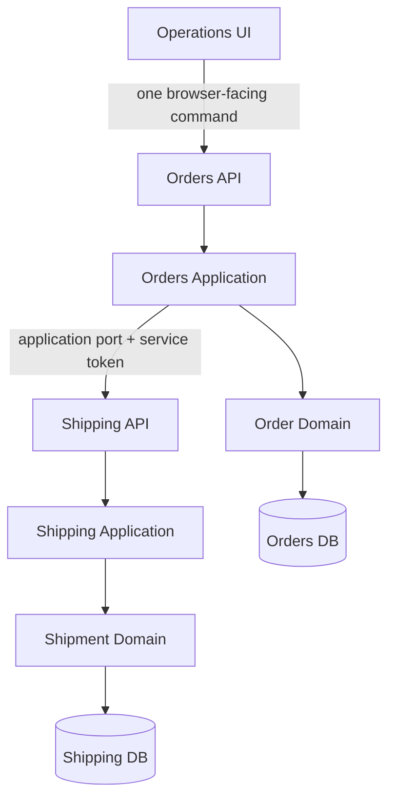
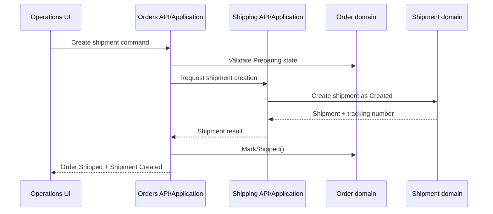

# Luna Ops - Fulfillment and Shipment Workflow Architecture

**Status:** Proposed  
**Scope:** Phase 1 - Luna Ops  
**Applies to:** Orders, Shipping, Operations UI, and customer order tracking  
**Primary concern:** Service boundaries and workflow orchestration

This document defines how the Phase 1 Operations workflow is allowed to collaborate across the Operations UI, Orders, and Shipping. The functional requirements remain in [phase-1-spec.md](phase-1-spec.md); this document defines the architectural shape that implementation must follow.

## Contents

- [1. Purpose](#1-purpose)
- [2. Architectural Principles](#2-architectural-principles)
- [3. High-Level Architecture](#3-high-level-architecture)
- [4. Single-Workflow Rule](#4-single-workflow-rule)
- [5. Browser-Facing API](#5-browser-facing-api)
- [6. Fulfillment Workflows](#6-fulfillment-workflows)
- [7. Shipping Service Boundary](#7-shipping-service-boundary)
- [8. Shipment Operations](#8-shipment-operations)
- [9. Repository Responsibilities](#9-repository-responsibilities)
- [10. Frontend Responsibilities](#10-frontend-responsibilities)
- [11. Operations Authorization](#11-operations-authorization)
- [12. State Ownership](#12-state-ownership)
- [13. Workflow Matrix](#13-workflow-matrix)
- [14. Complete Lifecycle](#14-complete-lifecycle)
- [15. Prohibited Patterns](#15-prohibited-patterns)
- [16. Phase 1 Reliability Boundary](#16-phase-1-reliability-boundary)
- [17. Implementation Rule](#17-implementation-rule)
- [18. Initial Implementation Checklist](#18-initial-implementation-checklist)

# 1. Purpose

The Phase 1 Luna Ops workflow moves an order through:

```text
Confirmed -> Preparing -> Shipped -> Delivered
```

The associated shipment moves through:

```text
no shipment -> Created -> InTransit -> Delivered
```

Shipment creation may fail without creating a shipment:

```text
Preparing -> ShippingPendingRetry -> retry -> Shipped
```

Phase 1 uses synchronous HTTP. It does not introduce asynchronous recovery, outbox processing, distributed transactions, or automatic retry workers.

# 2. Architectural Principles

## 2.1 Orders owns Order state

Orders is the authoritative owner of:

- Order status
- order items and immutable pricing snapshots
- payment and inventory references recorded on the order
- fulfillment state
- shipping-related order state

Only Orders may transition the Order aggregate:

```text
Confirmed -> Preparing
Preparing -> Shipped
Preparing -> ShippingPendingRetry
Shipped -> Delivered
```

The frontend and Shipping must never modify an Order status directly.

## 2.2 Shipping owns Shipment state

Shipping is the authoritative owner of:

- Shipment
- tracking identifier
- shipment recipient and delivery address snapshot
- shipment status and timestamps
- tracking events

Shipping owns these transitions:

```text
Created -> InTransit
InTransit -> Delivered
```

Orders must not directly modify Shipment state or access the Shipping database.

## 2.3 Orders owns workflow orchestration

Fulfillment remains a module inside Orders during Phase 1. Orders coordinates the workflow through application-owned ports and authenticated service clients. Shipping owns the Shipment aggregate but does not call an Orders repository or orchestrate Order state internally.

```text
Orders
  owns Order state
  coordinates fulfillment workflows

Shipping
  owns Shipment state
```

# 3. High-Level Architecture



The browser never addresses Docker service names or private service URLs. The existing Next.js gateway remains the public HTTP boundary.

# 4. Single-Workflow Rule

A single user action that represents one business operation must correspond to one browser-facing command.

For shipment creation, the browser calls:

```http
POST /api/services/orders/fulfillment/{orderId}/shipment
```

The Next.js proxy forwards this to Orders as:

```http
POST /api/v1/orders/fulfillment/{orderId}/shipment
```

Orders then coordinates:



The prohibited alternative is:

```text
Frontend
  -> POST /shipments
  -> POST /orders/{id}/mark-shipped
```

That would make the browser responsible for a distributed workflow and could leave a shipment created while the order remains `Preparing`.

# 5. Browser-Facing API

Operations requests use the existing Next.js proxy convention:

```text
Browser:  /api/services/orders/...
Backend:  /api/v1/orders/...
```

The Operations queue is an Operations-specific projection. It must not be forced into the generic customer order summary contract.

## 5.1 Fulfillment queue

```http
GET /api/v1/orders/fulfillment
```

Supported query parameters:

```text
status=Confirmed,Preparing,ShippingPendingRetry
search=
page=1
pageSize=25
```

Each item should include:

- order ID
- customer display information
- item count
- total
- payment status
- order status
- creation date
- backend-derived available action

The frontend must not calculate valid actions from status strings.

## 5.2 Fulfillment order details

```http
GET /api/v1/orders/fulfillment/{orderId}
```

The response should include the Operations order view: customer information, items, quantities, immutable prices, total, shipping address, payment status, order status, fulfillment timeline, shipment information when available, and the available Operations action.

This is a read model, not a second Order aggregate and not a cross-service database projection owned by the frontend.

## 5.3 Start preparation

```http
POST /api/v1/orders/fulfillment/{orderId}/prepare
```

The Orders application loads the aggregate, validates the current state, invokes the domain transition, persists the result, and returns the new state.

```text
Confirmed -> Preparing
```

Invalid transitions, such as `Shipped -> Preparing`, return `409 Conflict` and must not be silently normalized.

## 5.4 Create or retry shipment

```http
POST /api/v1/orders/fulfillment/{orderId}/shipment
```

The same command handles initial creation and operator retry. It is valid for:

```text
Preparing
ShippingPendingRetry
```

Orders validates the state, requests shipment creation from Shipping, marks the Order `Shipped` after success, and marks it `ShippingPendingRetry` when shipment creation fails. The browser does not need a separate retry endpoint.

# 6. Fulfillment Workflows

## 6.1 Start preparing

```text
Confirmed
    |
    | Start Preparing
    v
Preparing
```

The domain enforces `Confirmed -> Preparing`. Pricing, payment state, inventory reservation state, and shipment state are unchanged.

## 6.2 Create shipment

```text
Preparing
    |
    | Create Shipment
    +----------------------+
    |                      |
  success                failure
    |                      |
    v                      v
Shipped          ShippingPendingRetry
    |                      |
    |                      | Retry same command
    |                      +----------+
    |                                 |
    +---------------------------------+
```

The successful cross-service result is:

```text
Order:    Preparing -> Shipped
Shipment: none      -> Created
```

Invariants:

- An order has at most one shipment in Phase 1.
- A tracking identifier is generated only after shipment creation succeeds.
- A new shipment always starts as `Created`.
- A duplicate shipment creation request is rejected.

# 7. Shipping Service Boundary

Orders communicates with Shipping through an Application abstraction. The exact interface should follow existing Luna client conventions; the ownership boundary is the important part.

```csharp
public interface IShippingFulfillmentClient
{
    Task<ShipmentSnapshot> CreateShipmentAsync(
        Guid orderId,
        CancellationToken cancellationToken);

    Task MarkInTransitAsync(
        Guid shipmentId,
        CancellationToken cancellationToken);

    Task MarkDeliveredAsync(
        Guid shipmentId,
        CancellationToken cancellationToken);
}
```

The dependency direction is:

```text
Orders.Application
    -> IShippingFulfillmentClient
    -> Shipping.Infrastructure adapter
    -> Shipping API
```

Orders must not reference Shipping.Infrastructure directly. Shipping must not reference Orders repositories.

# 8. Shipment Operations

Shipping service-to-service endpoints remain separate from browser workflow commands.

## 8.1 Internal Shipping commands

```http
POST /api/v1/shipments
POST /api/v1/shipments/{shipmentId}/in-transit
POST /api/v1/shipments/{shipmentId}/delivered
```

These are consumed by Orders through the application port. They are not exposed as direct browser workflow endpoints.

## 8.2 Operations shipment reads

```http
GET /api/v1/shipments
GET /api/v1/shipments/{shipmentId}
```

The list supports:

```text
status=Created,InTransit,Delivered
search=
page=1
pageSize=25
```

The response should include shipment ID, tracking number, order ID, customer display information, shipment status, creation date, relevant timestamps, and the backend-derived available action.

## 8.3 Mark shipment in transit

Browser-facing command:

```http
POST /api/v1/orders/fulfillment/shipments/{shipmentId}/in-transit
```

Orders coordinates the request with Shipping. Shipping performs:

```text
Created -> InTransit
```

The associated Order remains `Shipped`.

## 8.4 Mark shipment delivered

Browser-facing command:

```http
POST /api/v1/orders/fulfillment/shipments/{shipmentId}/delivered
```

Orders coordinates:

```text
Shipping: InTransit -> Delivered
Orders:   Shipped   -> Delivered
```

The frontend performs neither transition itself.

# 9. Repository Responsibilities

Repositories only load and persist aggregates or read models. They do not call other services and do not coordinate workflows.

```text
API Controller
    -> Application Handler
       -> Domain Aggregate
       -> Repository
       -> Application Port
          -> Infrastructure Adapter
             -> External Service API
```

Prohibited examples:

```text
OrderRepository -> Shipping API
ShipmentRepository -> Order transition
```

# 10. Frontend Responsibilities

The Operations UI is responsible for:

- displaying backend state
- presenting backend-provided valid actions
- sending one business command per user action
- displaying success and failure
- refreshing state after mutations
- navigating between Operations pages

The frontend is not responsible for:

- changing Order or Shipment status locally
- deciding whether a transition is valid
- calling multiple services for one business operation
- generating tracking numbers
- deciding when an order becomes `Shipped` or `Delivered`

The current fulfillment rendering is [fullfilment.html](../ui_renderings/luna_ops/fullfilment.html). The related Operations renderings are [fullfilment_details.html](../ui_renderings/luna_ops/fullfilment_details.html), [create_shipment.html](../ui_renderings/luna_ops/create_shipment.html), [shipments.html](../ui_renderings/luna_ops/shipments.html), and [shipment_details.html](../ui_renderings/luna_ops/shipment_details.html).

# 11. Operations Authorization

Operations endpoints require a privileged Operations/Admin policy. Customer tokens may access only the customer's own order and tracking views.

```text
Customer
    -> own orders and shipment tracking

Operations/Admin
    -> fulfillment queue and details
    -> start preparation
    -> create or retry shipment
    -> shipment list and details
    -> mark in transit
    -> mark delivered

Service clients
    -> internal service-to-service commands
```

Authorization policy remains service-owned and should use the existing Luna authentication and service-token mechanisms rather than introducing a separate Luna Ops identity model.

# 12. State Ownership

| State | Owner | Who may transition it? |
| --- | --- | --- |
| Order `Confirmed` | Orders | Orders application/domain |
| Order `Preparing` | Orders | Orders application/domain |
| Order `ShippingPendingRetry` | Orders | Orders application/domain |
| Order `Shipped` | Orders | Orders application/domain |
| Order `Delivered` | Orders | Orders application/domain |
| Shipment `Created` | Shipping | Shipping application/domain |
| Shipment `InTransit` | Shipping | Shipping application/domain |
| Shipment `Delivered` | Shipping | Shipping application/domain |

The Operations UI requests transitions but owns none of this state.

# 13. Workflow Matrix

| Operation | Browser command | Workflow owner | State owners |
| --- | --- | --- | --- |
| Start preparation | `POST /orders/fulfillment/{id}/prepare` | Orders | Orders |
| Create shipment | `POST /orders/fulfillment/{id}/shipment` | Orders | Orders + Shipping |
| Retry shipment | Same shipment command | Orders | Orders + Shipping |
| Mark in transit | `POST /orders/fulfillment/shipments/{id}/in-transit` | Orders | Shipping |
| Mark delivered | `POST /orders/fulfillment/shipments/{id}/delivered` | Orders | Shipping + Orders |

Workflow ownership and state ownership are related but not identical. Orders coordinates; each domain changes only its own aggregate.

# 14. Complete Lifecycle

```text
                     CUSTOMER CHECKOUT
                            |
                            v
                       Confirmed
                            |
                            | Start Preparing
                            v
                       Preparing
                            |
                            | Create Shipment
                            |
                +-----------+-----------+
                |                       |
             success                  failure
                |                       |
                v                       v
        Shipment: Created       ShippingPendingRetry
                |                       |
                |                       | Retry same command
                |                       +----------+
                v                                  |
          Order: Shipped <-------------------------+
                |
                | Mark In Transit
                v
       Shipment: InTransit
                |
                | Mark Delivered
                v
       Shipment: Delivered
                |
                v
          Order: Delivered
```

# 15. Prohibited Patterns

The following patterns are intentionally prohibited:

```text
Frontend -> Shipping.CreateShipment()
Frontend -> Orders.MarkShipped()
```

```http
PATCH /api/v1/orders/{id}
```

with an arbitrary status body is not an acceptable lifecycle API.

Also prohibited:

- repositories coordinating service calls
- Shipping directly changing Order state
- frontend-generated tracking numbers
- more than one Phase 1 shipment for an order
- a local frontend state machine that advances an order without a backend response

# 16. Phase 1 Reliability Boundary

This architecture deliberately does not introduce:

- RabbitMQ
- outbox or inbox processing
- distributed transactions
- distributed locks
- automatic shipment retry workers
- dead-letter queues
- saga orchestration
- asynchronous fulfillment consumers
- advanced compensation

The Phase 1 recovery model is:

```text
shipment failure -> ShippingPendingRetry -> operator retry
```

# 17. Implementation Rule

Use this decision rule when implementing Luna Ops:

> If an action represents one business operation to the user, expose one browser-facing command for that operation.

Then:

> The application layer coordinates the workflow.

> Each domain owns its own state transitions.

> Repositories only load and persist aggregates or read models.

In compact form:

```text
             BUSINESS COMMAND
                    |
                    v
              Application
              /          \
             /            \
        Domain          Port
          |                |
          v                v
     Repository        Service API
```

# 18. Initial Implementation Checklist

- [ ] Orders fulfillment queue read model and endpoint
- [ ] Orders fulfillment order detail read model and endpoint
- [ ] `Confirmed -> Preparing` application command
- [ ] Orders-coordinated shipment creation command
- [ ] Shipping shipment lifecycle commands
- [ ] `Shipped -> Delivered` coordination
- [ ] Operations authorization policy
- [ ] Operations UI refreshes from backend state after commands
- [ ] Customer order tracking includes shipment information
- [ ] Fulfillment and shipment lifecycle integration tests

Related documents:

- [Phase 1 functional specification](phase-1-spec.md)
- [Phase 1 architecture](phase-1-architecture.md)
- [Luna Ops fulfillment rendering](../ui_renderings/luna_ops/fullfilment.html)
