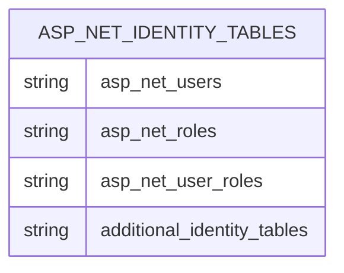
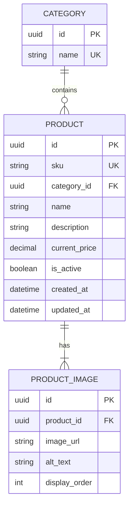
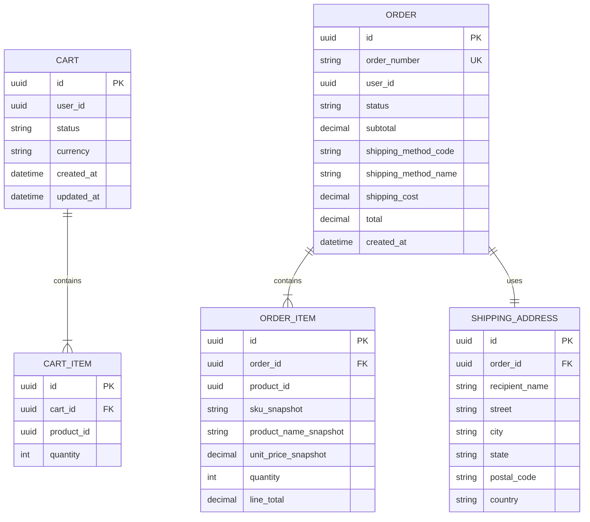
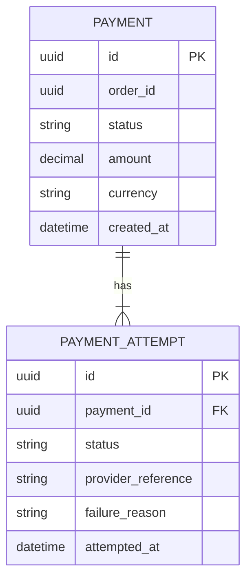
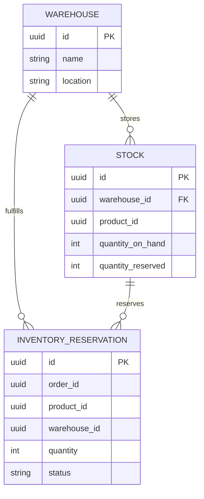
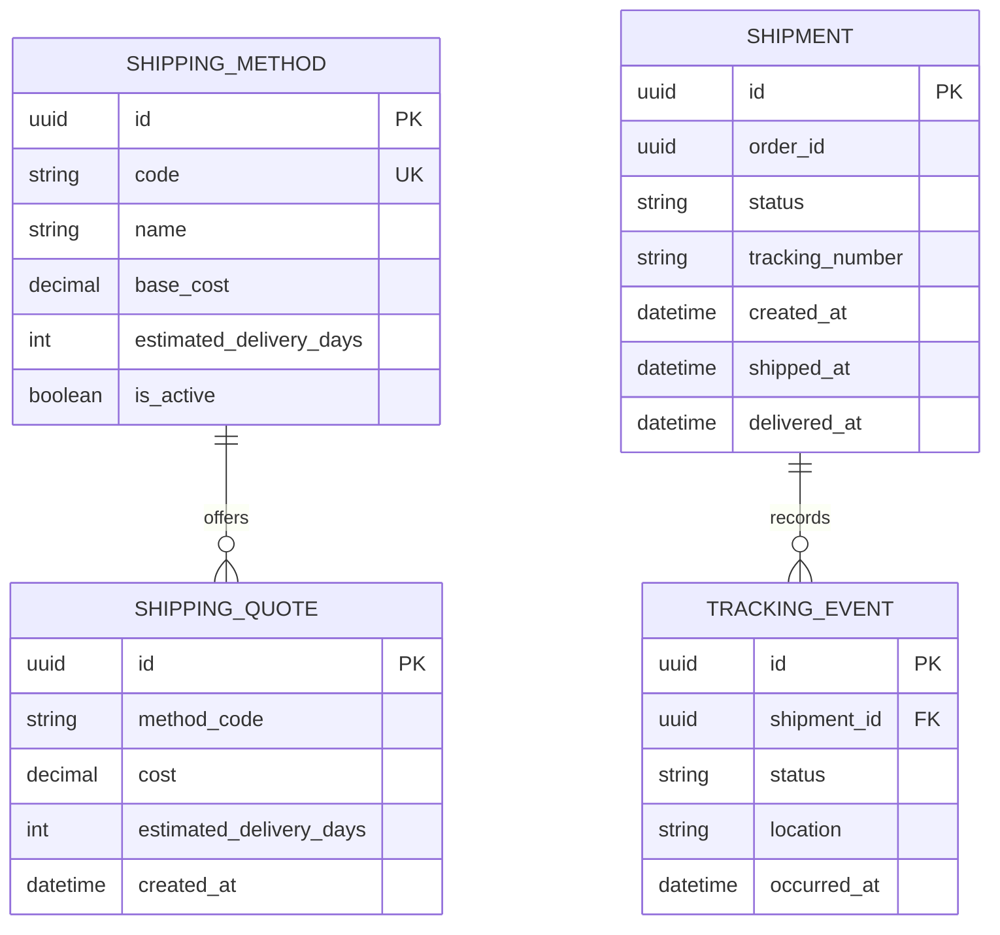
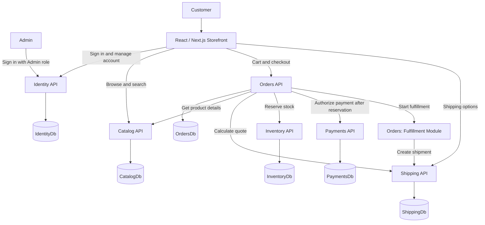

# Phase 1 Design

## Scope

Phase 1 delivers the basic commerce flow:

```text
Browse products -> Cart -> Checkout -> Pending Order
                                      -> Inventory reservation
                                      -> Payment authorization
                                      -> Confirmed Order
                                      -> Fulfillment
                                      -> Shipment -> Delivered
```

This phase focuses on a working happy path. Communication is synchronous HTTP, and the system does not yet include RabbitMQ, retries, dead-letter queues, transactional outbox processing, or simulated delays. Those concerns belong to later phases. Orders owns the checkout workflow and coordinates the downstream services.

## Contents

- [Scope](#scope)
- [Phase 1 Assumptions](#phase-1-assumptions)
- [Database Entity Diagram](#database-entity-diagram)
- [Phase 1 System Design](#phase-1-system-design)
- [Phase 1 Request Flows](#phase-1-request-flows)
- [Frontend Decisions](#frontend-decisions)
- [Intentionally Not Solved in Phase 1](#intentionally-not-solved-in-phase-1)
- [Phase 1 Completion Criteria](#phase-1-completion-criteria)
- [Confirmed Decisions](#confirmed-decisions)

## Phase 1 Assumptions

- Identity, Catalog, Orders, Payments, Inventory, and Shipping are separate application boundaries.
- Each application owns its own database and data.
- Fulfillment is an Orders module in Phase 1. It can become a separate service in Phase 7.
- IDs are shared as references between services, but cross-database foreign keys are not used.
- Orders stores snapshots of product prices and shipping costs at checkout.
- The cart does not lock product prices; Catalog owns the current price until checkout.
- Shipping calculates the quote at checkout, and Orders stores the returned cost as a snapshot.
- Inventory reserves available stock without warehouse allocation or split-fulfillment logic.
- Users are stored in `IdentityDb` and assigned roles such as `Customer` or `Admin`.
- A single order has one shipment in Phase 1. Multiple shipments are a later scenario.
- Customers cannot cancel orders, and Payments supports authorization only. Refunds are a later scenario.

## Database Entity Diagram

The diagrams show the logical entities owned by each database. Same-database relationships are shown in the diagrams. Relationships that cross a database boundary are references, not database-enforced foreign keys, and are listed separately below.

### IdentityDb



`IdentityDb` uses the schema provided by ASP.NET Core Identity, including `AspNetUsers`, `AspNetRoles`, `AspNetUserRoles`, and its other framework tables. Phase 1 does not add a custom customer profile.

### CatalogDb



### OrdersDb



### PaymentsDb



### InventoryDb



`Stock` has a unique constraint on `(warehouse_id, product_id)`, allowing only one stock record per warehouse and product.

### ShippingDb



### Database ownership

| Database | Entities | Notes |
| --- | --- | --- |
| `IdentityDb` | ASP.NET Core Identity tables | Owns user accounts and Phase 1 roles such as `Customer` and `Admin`. |
| `CatalogDb` | `Category`, `Product`, `ProductImage` | Owns product information, categories, current selling prices, and product image URLs. |
| `OrdersDb` | `Cart`, `CartItem`, `Order`, `OrderItem`, `ShippingAddress` | Owns the cart, order lifecycle, and historical checkout snapshots. `user_id` references the ASP.NET Core Identity user ID. Fulfillment is an Orders module in Phase 1. |
| `PaymentsDb` | `Payment`, `PaymentAttempt` | Owns payment state and the history of attempts. |
| `InventoryDb` | `Warehouse`, `Stock`, `InventoryReservation` | Owns stock and reservations. |
| `ShippingDb` | `ShippingMethod`, `ShippingQuote`, `Shipment`, `TrackingEvent` | Owns shipping methods, independent checkout quotes, and the single shipment created in Phase 1. |

### Cross-database references

These references are exchanged through API calls and stored as IDs. They are not cross-database foreign keys:

- `CartItem.product_id` -> `CatalogDb.Product.id`
- `Cart.user_id` -> `IdentityDb.AspNetUsers.Id`
- `Order.user_id` -> `IdentityDb.AspNetUsers.Id`
- `OrderItem.product_id` -> `CatalogDb.Product.id`
- `Payment.order_id` -> `OrdersDb.Order.id`
- `InventoryReservation.order_id` -> `OrdersDb.Order.id`
- `InventoryReservation.product_id` -> `CatalogDb.Product.id`
- `Shipment.order_id` -> `OrdersDb.Order.id`

## Phase 1 System Design

Phase 1 uses synchronous HTTP between services. Orders coordinates checkout and the happy-path workflow. RabbitMQ and asynchronous consumers are introduced in Phase 2.



## Phase 1 Request Flows

### Browse products

```text
Customer -> Storefront -> Catalog API -> CatalogDb
Customer <- Storefront <- Product results
```

### Add to cart

```text
Customer -> Storefront -> Orders API -> OrdersDb
                             |
                             +-> Catalog API -> CatalogDb
                                 (validate product and price)
```

### Checkout

```text
Customer
   |
   v
Storefront -> Orders API
                 |
                 +-> Catalog API: validate products and prices
                 +-> Shipping API: calculate shipping quote
                 +-> OrdersDb: create pending order and snapshots
                 +-> Inventory API: reserve stock
                 +-> Payments API: authorize payment after reservation
                 +-> Fulfillment module: prepare order
                                      |
                                      +-> Shipping API: create shipment
```

### Phase 1 failure behavior

- If inventory is unavailable, checkout fails before Payments is called. The order does not become `Confirmed`.
- If payment authorization fails, Orders marks the order `PaymentFailed` and Inventory releases the reservation.
- If shipment creation fails after fulfillment, the order remains in `ShippingPending` and is not retried automatically.

These are simple Phase 1 decisions, not a complete distributed recovery strategy. Phase 4 and Phase 16 will define retries, idempotency, compensation, and recovery in detail.

## Intentionally Not Solved in Phase 1

Phase 1 deliberately does not attempt to solve distributed consistency or complete failure recovery. The synchronous happy path and three explicit failure outcomes above are the learning target for this phase.

The following scenarios are known limitations:

- Payment succeeds but order completion fails.
- A service becomes unavailable during checkout.
- A request is submitted more than once.
- A timeout occurs after a downstream operation actually succeeds.
- A service crashes after modifying its database but before returning a response.
- No automatic retry or recovery exists for `ShippingPending`.
- Customers cannot cancel orders.
- Orders cannot be split across multiple shipments.
- Inventory does not select or allocate across multiple warehouses.
- Payments cannot capture, void, or refund an authorization.
- Fulfillment and shipping use no simulated delays.

These scenarios are intentionally deferred to later phases where retries, idempotency, messaging, compensation, observability, and recovery mechanisms will be introduced.

## Phase 1 Completion Criteria

- A customer can browse active products.
- A customer can add products to a cart and update quantities.
- Checkout validates products and calculates a shipping quote.
- Checkout creates an order with immutable product-price and shipping-cost snapshots.
- Inventory is reserved for the order.
- Checkout fails before payment when inventory is unavailable.
- A failed payment releases the inventory reservation and marks the order `PaymentFailed`.
- Payment is recorded through the payment service and fake provider after inventory is reserved.
- Fulfillment marks the order as prepared inside the Orders boundary.
- The fulfillment module creates a shipment through Shipping after the order is prepared.
- A shipment failure leaves the order in `ShippingPending` without automatic retry.
- The order lifecycle supports `Pending`, `Confirmed`, `Preparing`, `Shipped`, and `Delivered`, with `PaymentFailed`, `ShippingPending`, and `Cancelled` as non-happy-path states.
- The customer can view order history and the order's current lifecycle status.

## Frontend Decisions

### Data Fetching

- TanStack Query manages server state.
- Axios is the initial HTTP transport underneath the typed API client modules.
- API access is centralized through typed API client modules rather than scattered HTTP calls inside components.
- TanStack Query manages loading, error, caching, refetching, and mutation state.
- Frontend state is not authoritative for backend business data.
- After mutations, affected queries are invalidated or updated to keep the UI synchronized with the backend.

### Product Catalog

- Products have one or more images and belong to a category.
- Products do not have ratings or reviews in Phase 1.
- Product search is by product name only.
- Product availability is determined by inventory quantity: `0` displays as `Unavailable`, and values greater than `0` display as `Available`.
- Customers can select the desired quantity when multiple units are available.
- Insufficient inventory is handled during checkout, not during browsing or cart operations.
- Phase 1 uses simple image URLs; image storage and CDN infrastructure are deferred.

### Cart

- The Orders API returns an enriched cart so the frontend does not reconstruct product information independently.
- Cart supports quantity changes and item removal.
- The frontend does not call Catalog separately for every cart item.

### Checkout

- Checkout is a single page with sections for shipping information, shipping method, payment, and order summary.
- Phase 1 has one simulated payment method and two fixed, always-available shipping options.
- Saved addresses are not included; the customer enters the shipping address during checkout.
- The order summary separates subtotal, shipping, and total.

### Authentication

- Login is required for Phase 1.
- Anonymous shopping and cart behavior are outside the Phase 1 scope.

### Order Status

- The frontend presents customer-friendly statuses rather than exposing internal service terminology directly.
- Example display statuses are `Order placed`, `Payment confirmed`, `Preparing your order`, `Shipped`, `In transit`, and `Delivered`.

## Confirmed Decisions

The following decisions are now part of the Phase 1 design:

1. Payment failure marks the order `PaymentFailed` and releases the inventory reservation. No retry is attempted.
2. Inventory unavailability fails checkout before payment authorization.
3. Shipping failure leaves the order in `ShippingPending` for later recovery work.
4. Orders owns and orchestrates checkout across Catalog, Shipping, Inventory, Payments, and the Fulfillment module.
5. Shipping calculates shipping prices; Orders requests the quote at checkout and stores its cost as a snapshot.
6. Catalog owns the current product price; Orders snapshots the product price at checkout. The cart does not lock prices.
7. Fulfillment is simple in Phase 1, with no random processing or delivery delays.
8. An order becomes paid after Payments successfully authorizes it through the fake provider.
9. The core order lifecycle is `Pending` -> `Confirmed` -> `Preparing` -> `Shipped` -> `Delivered`.
10. `PaymentFailed`, `ShippingPending`, and `Cancelled` are non-happy-path states. Customers cannot cancel orders in Phase 1.
11. A Phase 1 order has exactly one shipment.
12. Inventory reserves stock if available; it does not allocate across warehouses or split fulfillment.
13. Payments supports authorization only. Capture, void, and refund are later capabilities.
14. Users live in `IdentityDb`; users receive roles including `Customer` and `Admin`. Orders does not own customer records.
15. REST APIs use ASP.NET Core Controllers; controllers contain HTTP concerns only and delegate business operations to commands and queries.
16. TanStack Query manages frontend server state, and Axios is the initial HTTP transport used through centralized typed API clients.