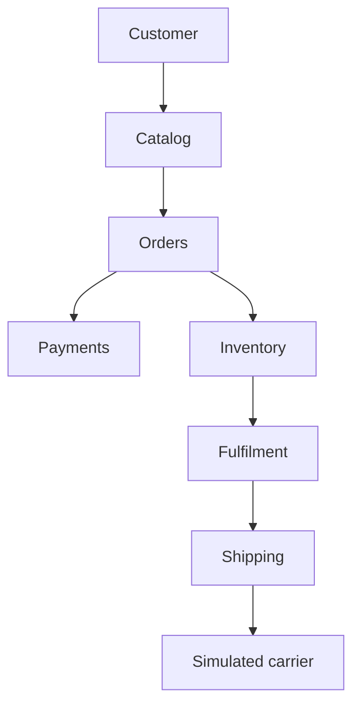
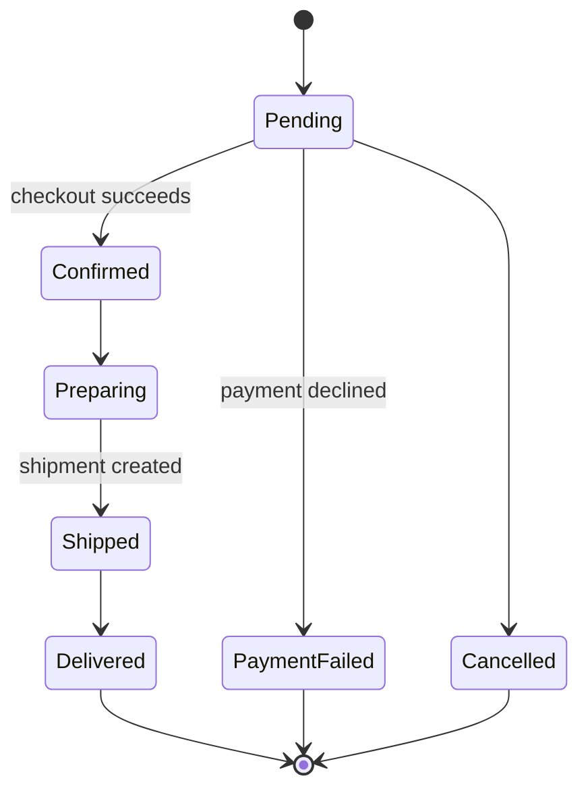
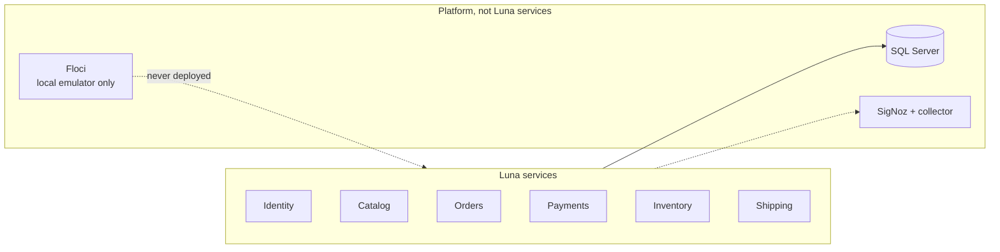

# Luna Roadmap

> A distributed commerce and logistics simulation built to explore what happens when real-world complexity, failure, and asynchronous behavior enter the picture.

## Contents

- [Why Build Luna?](#why-build-luna)
- [End Goal](#end-goal)
- [Customer Experience](#customer-experience)
- [Operations Console](#operations-console)
- [Architecture](#architecture)
  - [Bounded Contexts](#bounded-contexts)
  - [Communication](#communication)
  - [Reliability Patterns](#reliability-patterns)
  - [Payment Abstraction](#payment-abstraction)
  - [Shipping](#shipping)
- [Technology](#technology)
- [Development Philosophy](#development-philosophy)
- [Clean Architecture and DDD](#clean-architecture-and-ddd)
- [Phase 0 Design](dev_phases/phase-0/design.md)
- [Phase 1 Specification](dev_phases/phase-1/spec.md)
- [Phase 1 Architecture](dev_phases/phase-1/architecture.md)
- [Phase 2 Specification](dev_phases/phase-2/spec.md)
- [Phase 2 Architecture](dev_phases/phase-2/architecture.md)
- [Implementation Roadmap](#implementation-roadmap)
  - [Phase 0: Architecture and Foundation](#phase-0-architecture-and-foundation)
  - [Phase 1: Basic Commerce Flow](#phase-1-basic-commerce-flow)
  - [Phase 2: Messaging and Async Workflows](#phase-2-messaging-and-async-workflows)
  - [Phase 3: Realistic Time and Simulation](#phase-3-realistic-time-and-simulation)
  - [Phase 4: Reliability and Failure Handling](#phase-4-reliability-and-failure-handling)
  - [Phase 5: Transactional Outbox](#phase-5-transactional-outbox)
  - [Phase 6: Payment Abstraction](#phase-6-payment-abstraction)
  - [Phase 7: Fulfillment Service](#phase-7-fulfillment-service)
  - [Phase 8: Observability](#phase-8-observability)
  - [Phase 9: Operations Dashboard](#phase-9-operations-dashboard)
  - [Phase 10: Redundancy and Resilience](#phase-10-redundancy-and-resilience)
  - [Phase 11: Chaos and Failure Simulation](#phase-11-chaos-and-failure-simulation)
  - [Phase 12: Security](#phase-12-security)
  - [Phase 13: Testing and Quality](#phase-13-testing-and-quality)
  - [Phase 14: Production-like Local Infrastructure](#phase-14-production-like-local-infrastructure)
  - [Phase 15: AWS](#phase-15-aws)
  - [Phase 16: Production Scenarios and Edge Cases](#phase-16-production-scenarios-and-edge-cases)
- [Project Status](#project-status)

## Why Build Luna?

Luna is primarily a learning and experimentation platform. It explores concepts that are difficult to understand through isolated examples:

- Microservice boundaries and bounded contexts
- Asynchronous communication and event-driven architecture
- EventBridge and SQS through a local AWS emulator, and eventual consistency
- Transactional outbox and idempotency
- Retries and dead-letter queues
- Distributed tracing, structured logging, metrics, and health checks
- Service redundancy, failure recovery, and chaos testing
- API security and integration testing
- Containerized infrastructure and AWS equivalents

The architecture will evolve as the project exposes new problems. The objective is not to design the perfect architecture upfront, but to encounter realistic engineering problems and solve them deliberately.

## End Goal

Luna is a locally hosted, production-inspired distributed system that simulates an e-commerce order from checkout through delivery, with an operations console for watching business health, infrastructure health, failures, and recovery.



The shape Luna is heading towards. What exists today is the synchronous subset of
this, described in [architecture.md](architecture.md); the inventory-to-fulfilment
handoff becomes asynchronous messaging in Phase 2.

A free local AWS emulator (Floci) serves EventBridge, SQS, and SES on the developer's machine, so Luna calls the AWS APIs it will use in Phase 15 rather than running a different broker locally and translating it later. The emulator is a development tool and is never deployed.

## Customer Experience

Customers can:

- Browse, search, and filter products
- Add products to a cart
- Select shipping methods and view shipping costs
- Checkout and place orders
- View order history
- Track order progress through a timeline

An order progresses through this lifecycle, which is the `OrderStatus` enum in
`src/Services/Orders/Orders.Domain/Order.cs`:



The transition rules, and how the order and shipment state machines interlock,
are in [architecture.md](architecture.md).

## Operations Console

Luna has an internal operations console covering the fulfillment queue, the
fulfillment detail view, and shipments. What it does not yet do is aggregate
service health into a single business-level dashboard; the view below is a
target rather than a screen.

### Infrastructure health



Fulfillment is a module inside Orders, not a service of its own, and the
emulator is a development tool that is never deployed.

### Business health

Examples the console should grow into:

- Order stuck in fulfillment
- Shipment delayed
- Payment failure rate increasing
- Payment service unavailable
- SQS queue backlog increasing

The goal is to show not only whether a service is running, but whether the business is functioning correctly.

## Architecture

Luna is composed of independently deployable services. Each service owns its domain and persistence. Services do not directly access one another's databases; communication happens through APIs and asynchronous events.

During the initial web application phases, Next.js acts as a thin frontend gateway. It is the public application entry point, while the backend services remain HTTP APIs on the private Docker network and are not publicly exposed by default. The gateway forwards service contracts without introducing BFF DTOs or aggregation. That decision can be revisited when the Operations Console exposes a concrete need for aggregated views.

Authentication follows the same boundary: ASP.NET Core Identity owns users, passwords, roles, and account management; OpenIddict in the Identity service provides the OAuth 2.0/OpenID Connect authorization server; backend services validate access tokens but do not issue them. `Luna.Contracts` defines shared token semantics, while the `Luna.Authentication` class library standardizes JWT validation without becoming another deployable service. Next.js is the preferred OIDC client and server-side session boundary, keeping access tokens out of browser JavaScript by default.

### Bounded Contexts

Planned contexts include:

- Catalog
- Orders
- Payments
- Inventory
- Fulfillment
- Shipping
- Notification (Phase 2)

Initial databases, one per service:

```text
Identity      -> IdentityDb
Catalog       -> CatalogDb
Orders        -> OrdersDb
Inventory     -> InventoryDb
Payments      -> PaymentsDb
Shipping      -> ShippingDb
```

Fulfillment is initially planned as a bounded context that can be extracted into its own service when the warehouse process becomes complex enough. It is currently a module inside Orders.

### Communication

The system will progressively move from simple synchronous calls to asynchronous events. Events are published to the bus; work items are sent straight to the queue owned by the service that performs them:

```text
Orders
   |
   | OrderConfirmed (PutEvents)
   v
EventBridge (luna-bus)
   +------> luna-notification-orders ---> Notification
   +------> other consumer queues

Luna Ops
   |
   | SendMessage (command, Phase 3)
   v
luna-orders-shipment-commands ------------> Shipping/Orders worker
```

Example events:

`OrderConfirmed`, `PaymentAuthorized`, `PaymentFailed`, `InventoryReserved`, `InventoryReservationFailed`, `FulfillmentStarted`, `OrderPacked`, `ShipmentCreated`, `ShipmentInTransit`, and `ShipmentDelivered`.

### Reliability Patterns

The standard event flow will eventually include:

```text
Database transaction -> Outbox -> Event publisher -> EventBridge -> SQS queue -> Consumer
                                                                        |
                                                          Retry -> Idempotency -> DLQ
```

The system will also use timeouts and graceful shutdown so that failures can be observed and recovered from deliberately.

### Payment Abstraction

Payments depend on an `IPaymentProvider` rather than a specific provider.

```text
Payment Service -> IPaymentProvider -> FakePaymentProvider
```

The fake provider simulates authorization, capture, decline, timeout, provider errors, voids, and refunds. No real money is processed by Luna.

### Shipping

Shipping has two responsibilities:

1. Calculate and quote shipping during checkout.
2. Create and track shipments after fulfillment.

```text
Checkout:    Order -> Shipping -> Shipping Quote
Fulfillment: Fulfillment -> Shipping -> Carrier -> Tracking
```

Shipping owns the rate calculation. Orders snapshots the resulting shipping cost, along with product prices, so historical orders are not changed by future rate changes. Later, shipping quotes can expire and support multiple simulated carriers.

## Technology

| Area | Technologies |
| --- | --- |
| Backend | C#, .NET, ASP.NET Core, Entity Framework Core, SQL Server |
| Frontend framework | React, TypeScript, Next.js |
| Frontend forms | React Hook Form, Zod, `@hookform/resolvers` |
| Frontend server state | TanStack Query |
| Frontend HTTP | Axios through centralized typed API clients |
| Frontend testing | Vitest, Testing Library, Playwright |
| Messaging | EventBridge, SQS, SES through the AWS SDK, emulated locally by Floci |
| Local emulator | Floci (MIT, no account or token) plus Floci UI on port 4500 for inspection |
| Infrastructure | Docker, Docker Compose |
| Observability | OpenTelemetry, SigNoz, structured logging |
| Testing | xUnit, FluentAssertions, Moq, Testcontainers, Playwright |
| Cloud | AWS equivalents explored in later phases |

The initial implementation runs in the local Docker Compose stack. From Phase 2 the same stack also runs on the self-hosted server through Dokploy, with the emulator supplying the AWS services it emulates. Phase 15 changes the endpoints to real AWS.

## Development Philosophy

Complexity will be introduced when it solves a real problem:

```text
Simple synchronous workflow
        -> Asynchronous messaging
        -> Failure handling
        -> Outbox
        -> Idempotency
        -> Observability
        -> Redundancy
        -> Chaos testing
```

Each stage should build on the previous one without requiring large-scale rewrites. Testing begins in Phase 1 and expands as the system's risk and blast radius grow.

## Clean Architecture and DDD

Apply Clean Architecture and Domain-Driven Design as a dedicated learning and implementation topic across Luna's services.

The focus is to:

- Keep presentation, application, domain, and infrastructure responsibilities clear, with dependencies directed toward the business core.
- Model each bounded context using its own ubiquitous language and domain concepts instead of sharing one universal model across services.
- Gradually turn data-oriented classes into meaningful domain models: entities, value objects, aggregates, aggregate roots, domain services, and domain events.
- Treat aggregate roots as the entry point for enforcing business invariants; for example, `Product` owns and protects its `ProductImage` collection.
- Continue the existing CQRS-style separation between read and write paths, using projections for read-heavy endpoints where that tradeoff is intentional.
- Document architectural decisions and deliberate deviations, such as Infrastructure projecting directly to service contract DTOs to avoid unnecessary entity materialization and in-memory mapping.

**Outcome:** Luna's code and service boundaries should communicate the business clearly, protect domain rules, and make architectural tradeoffs explicit.

## Implementation Roadmap

### Phase 0: Architecture and Foundation

**Goal:** Establish service boundaries, projects, databases, Docker, configuration, health endpoints, logging, correlation IDs, API conventions, migrations, testing conventions, and the Clean Architecture/DDD foundations described above.

**Milestone:** All services run independently and communicate through defined APIs and events.

### Phase 1: Basic Commerce Flow

**Goal:** Build the customer storefront and complete the happy-path lifecycle: catalog, cart, checkout, order, payment, inventory, fulfillment, shipping, and delivery.

Frontend rendering and data-fetching boundaries:

- Catalog and product content -> Next.js Server Components.
- Cart -> Client Components + TanStack Query.
- Checkout interactions -> Client Components + TanStack Query.
- Shipping quotes -> Client Components + TanStack Query.
- Interactive inventory availability -> Client Components + TanStack Query.

**Milestone:** A customer can place an order and eventually see it delivered.

### Phase 2: Messaging and Async Workflows

**Decision:** Phase 2 runs on **Floci**, a free MIT-licensed local AWS emulator serving EventBridge, SQS, and SES on port `4566`, instead of RabbitMQ. It needs no account, auth token, or paid tier, and it is deployed rather than local-only: the same stack runs locally and on the self-hosted server through Dokploy. A separate **Floci UI** container on port `4500` gives a local browser for queues, EventBridge rules, and captured SES mail; it is a development tool and is never deployed. The rationale, the accepted caveats, the rejected alternatives (RabbitMQ and LocalStack), and the one-to-one AWS mapping contract are recorded in the [phase 2 decision record](dev_phases/phase-2/architecture.md#decision-record-floci-eventbridge--sqs--ses-instead-of-rabbitmq). RabbitMQ is not used anywhere in Luna.

**Goal:** Introduce asynchronous messaging through the AWS SDK: an EventBridge bus, SQS queues with DLQs and redrive policies, routing rules, long-polling consumers, at-least-once delivery, competing consumers, and eventual consistency. Domain events go to the bus, work items go directly to a queue. The bus, queues, rules, and sender identity are declared in Terraform, so the same files apply locally, on the server, and on AWS in Phase 15. A new Notification bounded context consumes its own queues and emails customers through SES. Publishing happens directly after the database commit, leaving the known dual-write window to be observed here and fixed by the Phase 5 outbox; duplicates are likewise surfaced here and fixed by Phase 4 idempotency. The Ops shipment-creation command queue is deferred to Phase 3.

**Milestone:** A customer places an order, watches it progress asynchronously, and receives emails produced by an independent service consuming its own queue, using the same calls that will run unchanged on AWS.

**Deferred to Phase 3:** the command queue (`luna-orders-shipment-commands`) that moves Ops shipment creation from a synchronous command to a direct `SendMessage`.

### Phase 3: Realistic Time and Simulation

**Goal:** Add configurable simulation speed, randomized processing times, delays, and failures such as payment errors, carrier failures, inventory shortages, outages, and slow dependencies. Incorporate deferred Phase 2 shipment command queue workflow (direct SQS `SendMessage` from Luna Ops) to complete the async Ops developer experience.

**Milestone:** A batch of orders can progress naturally while failures are observable locally. The shipment command queue, previously deferred from Phase 2, is now implemented: Luna Ops can enqueue shipment-creation commands that compete for processing, with redrive to DLQ after maxReceiveCount, matching the same SQS patterns established in Phase 2.

### Phase 4: Reliability and Failure Handling

**Goal:** Add transient versus permanent failure handling, retries with backoff, idempotency, dead-letter queues, timeouts, and graceful shutdown.

**Milestone:** Deliberately broken components can recover correctly.

### Phase 5: Transactional Outbox

**Goal:** Persist domain changes and their events in one transaction, then publish through an outbox worker.

**Milestone:** A database commit cannot silently lose a business event.

### Phase 6: Payment Abstraction

**Goal:** Model payment attempts, idempotency keys, authorization, capture, void, refunds, and provider failures behind `IPaymentProvider`.

**Milestone:** Payments behave like an external dependency without processing real money.

### Phase 7: Fulfillment Service

**Goal:** Separate inventory (do we have the item?) from fulfillment (have we prepared it?) and shipping (where is the package?).

**Milestone:** Warehouse operations are independently modeled and communicated through events.

### Phase 8: Observability

**Goal:** Add structured logs, distributed traces, metrics, and health checks using OpenTelemetry and SigNoz.

Track order and payment durations, failures, queue depth, DLQ size, and correlation and trace IDs.

**Milestone:** An operator can determine where and why a workflow failed.

### Phase 9: Operations Dashboard

**Goal:** Build a control center showing service health, business alerts, queue depth, failed messages, processing times, payment success rate, latency, and stuck orders.

**Milestone:** The dashboard becomes a window into the distributed system.

### Phase 10: Redundancy and Resilience

**Goal:** Run multiple service and consumer instances behind load balancing. Add readiness and liveness checks, connection recovery, circuit breakers, timeouts, graceful shutdown, and recovery experiments.

**Milestone:** The platform continues operating when an individual instance is killed.

### Phase 11: Chaos and Failure Simulation

**Goal:** Add operations controls to pause services, inject payment or carrier failures, increase fulfillment delays, and observe backlog recovery.

**Milestone:** Failure, detection, recovery, and observability can be demonstrated end to end.

### Phase 12: Security

**Goal:** Add OAuth/OIDC, JWT authentication, authorization and RBAC, service-to-service security, HTTPS, secrets management, rate limiting, validation, and audit logging.

Roles include Customer, Warehouse Operator, Support, and Administrator.

### Phase 13: Testing and Quality

**Goal:** Expand unit, integration, contract, end-to-end, and failure testing.

Use real databases and the pinned emulator image through Testcontainers. Cover duplicate events, service outages, database failures, consumer crashes, carrier timeouts, and other unhappy paths.

### Phase 14: Production-like Local Infrastructure

**Goal:** Run Luna in a production-like local environment and learn how infrastructure is provisioned and configured.

This phase includes Docker and Docker Compose, a reverse proxy or gateway, multiple service instances, databases, the local AWS emulator, observability, CI/CD, backups, production-like configuration, and self-hosted infrastructure automation with Ansible. Terraform already covers the emulated AWS resources from Phase 2; this phase extends that same practice to the host-level and cloud-level infrastructure.

The learning progression is:

```text
Terraform
        ↓ Provision infrastructure
Ansible
        ↓ Configure Linux hosts
Docker
        ↓
Docker Compose
        ↓
Luna
```

### Phase 15: AWS

**Goal:** Explore how the production-like local architecture maps to AWS and learn managed container deployment. Because Phase 2 already speaks to EventBridge, SQS, and SES through the AWS SDK and declares them in Terraform, this phase is a change of endpoint rather than a messaging rewrite.

Terraform provisions and configures the AWS infrastructure:

```text
Terraform
        ↓ AWS infrastructure
        ├── VPC
        ├── Networking
        ├── IAM
        ├── ECS/Fargate
        ├── RDS
        ├── S3
        ├── EventBridge   (already declared in Phase 2)
        ├── SQS           (already declared in Phase 2)
        ├── SES           (already declared in Phase 2)
        ├── API Gateway
        └── CloudWatch
```

The local-to-cloud translation is:

| Local | AWS |
| --- | --- |
| Docker Compose | ECS/Fargate |
| SQL Server container | RDS |
| Emulated EventBridge | EventBridge |
| Emulated SQS queues and DLQs | SQS |
| Emulated SES | SES |
| S3-like storage | S3 |
| Reverse proxy | ALB/API Gateway |
| Local configuration and secrets | Secrets Manager |
| Logs | CloudWatch |
| Terraform (`infrastructure/terraform/`) | Terraform |
| Terraform | Terraform |

The point is to understand how cloud infrastructure provides capabilities the local system already demonstrates.

### Phase 16: Production Scenarios and Edge Cases

**Goal:** Challenge the completed system with realistic business and distributed-system failures, then document ownership, persistence, events, retries, idempotency, customer impact, operational impact, and recovery.

Scenarios include:

- Duplicate messages and duplicate payment requests
- Payment success followed by order creation failure
- Payment failure after inventory reservation
- Inventory reservation expiration
- Order cancellation at different lifecycle stages
- Product price or shipping quote changes after checkout
- Delayed fulfillment and carrier failures
- Carrier and internal tracking discrepancies
- Multiple warehouses and multiple shipments per order
- Emulator, database, and service instance outages
- Slow dependencies and message backlog recovery
- Event and schema version changes

## Project Status

**Current position: Phase 0 complete; Phase 1 implementation substantially complete and in closure; Phase 2 specified with the Floci messaging direction accepted and the emulator verified locally, but no Phase 2 service code yet; the initial Luna Ops workflow and observability foundation are delivered ahead of the original sequence.**

Luna is being built incrementally. Architecture and implementation decisions may change as new requirements and failure scenarios are introduced. The repository is intentionally a work in progress.

### Recorded quality gate

Coverage is measured and enforced in CI as of 2026-10-01. The numbers below are the first measured values; they
replace the previous state, where no coverage number was recorded anywhere in the repository and the
thresholds in `scripts/test-coverage.sh` and `vitest.config.mjs` were never evaluated by anything.

| Metric | Measured | Gate | Enforced by |
| --- | --- | --- | --- |
| Backend branch coverage | 83.5% | 80% | `scripts/check-backend-coverage.mjs`, called from `ci.yml` |
| Frontend branch coverage | 94.9% | 90% | `vitest run --coverage` |
| Frontend statements | 93.7% | — | reported in the CI summary |

Backend coverage merges the unit and integration suites through ReportGenerator. Integration coverage is
collected because that is where repositories, checkout orchestration, and controllers are actually exercised;
without it the number only reflects unit tests. Frontend thresholds are now live because `npm test` runs
`vitest run --coverage`, and Vitest only enforces a threshold when a coverage reporter is active.

Both numbers are published to the CI run summary, so neither requires opening an artifact to read. The
backend gate is deliberately set just below the measured value so it fails on a regression rather than on the
current backlog; the remaining gap is concentrated in the Identity host and in the Infrastructure
repositories, and raising the gate further is a later outcome driven by the coverage report rather than by a
number chosen in advance.

The layering rules in `AGENTS.md` are likewise executable now:
`tests/Unit/Architecture/LayeringArchitectureTests.cs` asserts that domain projects reference no other Luna
project, that no domain type reaches for EF Core, HTTP, or ASP.NET Core, that Application does not depend on
the Api host or on Infrastructure, that Infrastructure does not cross into another service's Infrastructure,
and that no controller names a `DbContext` or an Infrastructure repository.

### Current implementation snapshot

Phase 0 is complete: the six services, independent persistence, EF Core migration startup, Docker Compose environment, health endpoints, OpenAPI documentation, centralized tests, Next.js gateway, and CI/container publishing foundations are in place.

Test counts as of 2026-10-01: 226 unit tests, 103 integration tests, 147 frontend tests. The integration suite
is Docker-dependent and requires SQL Server containers through Testcontainers.

Phase 1 is substantially implemented through the synchronous customer commerce path. The catalog storefront supports server-rendered active products, search, category filtering, URL-based pagination, product details, and image galleries. Authenticated customers can use the cart, checkout, order history, order details, account pages, and the Identity/OpenIddict session boundary. Orders coordinates Catalog, Shipping, Inventory, and Payments through authenticated service clients; Inventory provides concurrency-safe reservations and release; Payments provides deterministic authorization with concurrency protection; and Orders persists price/shipping snapshots, fulfillment state, and checkout idempotency.

The initial Luna Ops workflow is also implemented: operators can review and filter the fulfillment queue, prepare orders, create shipments through an Orders-coordinated command, list and inspect shipments, and advance shipments from Created to InTransit to Delivered. The browser uses backend-derived available actions and does not own lifecycle state transitions.

The project also has a delivered observability foundation ahead of the original phase sequence: OpenTelemetry instrumentation, OTLP collection, SigNoz local infrastructure, host metrics, a tracked service-health dashboard, checkout stage logging, health checks, and a frontend SigNoz link. This is not yet the Phase 9 Operations Console or Phase 11 failure-injection tooling.

Phase 1 closure is still pending the implementation review; the recorded quality gate is now in place. The complete checkout and compensation failure matrix is now proven across real service boundaries: successful checkout across Catalog, Shipping, Inventory, and Payments, insufficient inventory without payment attempt, payment failure with reservation release, shipment creation failure that leaves the order `Preparing` with a successful subsequent attempt, and repeated idempotent checkout requests replaying a single order, reservation, payment, and quote. Customer order details read customer-scoped shipment identifiers, status, and tracking events from Shipping, and real Orders/Shipping HTTP lifecycle tests cover fulfillment through delivery plus invalid and duplicate shipment transitions. The Docker-dependent integration suite passes locally, and the frontend build, Compose smoke checks, and coverage are now recorded together in the quality gate above. Frontend checkout error-state coverage is present and is no longer a closure blocker.

### Phase position

| Phase | Position | Notes |
| --- | --- | --- |
| 0 | Complete | Foundation, service boundaries, infrastructure, CI, and baseline security are implemented. |
| 1 | In closure | Synchronous commerce path, customer tracking, the Orders/Shipping lifecycle proof, and the real-boundary checkout failure matrix are implemented; the quality gate is recorded and enforced in CI, and the closure review remains. |
| 2 | Specified, infrastructure started | The Phase 2 specification and architecture are accepted. Floci (EventBridge + SQS + SES) replaces the earlier RabbitMQ plan and the earlier LocalStack choice, and the Ops command queue is deferred to Phase 3. The emulator and its UI are wired into the local Compose stack, and the bus, queues, DLQs, rules, and sender identity are declared in Terraform and verified against the emulator; the producers and the Notification service do not exist yet. |
| 3-7 | Not started | Simulation, reliability, outbox, fuller payment lifecycle, and Fulfillment extraction remain future work. |
| 8 | Foundation delivered | Telemetry and local SigNoz are implemented; operational dashboards and workflows remain later work. |
| 9-16 | Not started | Operations Console, redundancy, chaos, advanced security, production infrastructure, AWS, and scenario exercises remain future work. |

### Next steps

1. Close Phase 1 with an implementation review, then continue Phase 2 by adding the event producers and the Notification service around the completed synchronous commerce workflow, while preserving synchronous HTTP where an immediate response is required. The emulator runs locally and the messaging resources are managed by Terraform.

Asynchronous consumers, retries, dead-letter queues, the transactional outbox, and distributed recovery remain future work. Observability should be used while implementing those phases so the new failure behavior is visible from its first version.
